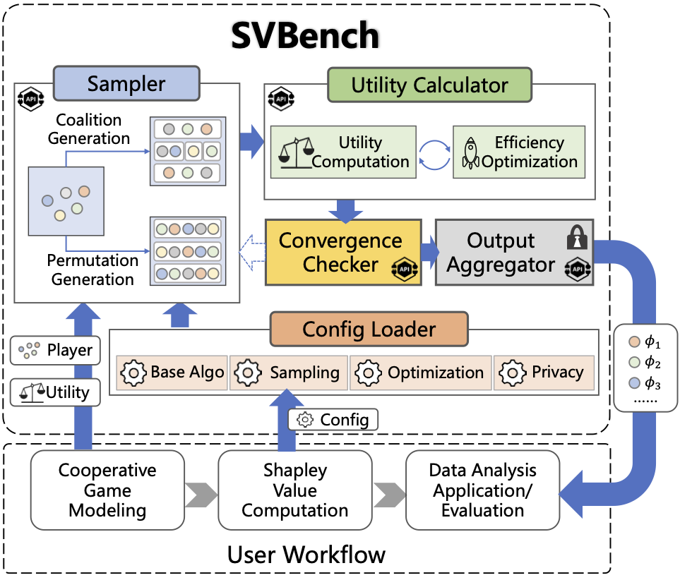

# **_SvBench_**

_SvBench_ is a free, powerful benchmark that provides a series of algorithms for both exact computing and approximate computing of Shapley Value in data analytics.
A related publication can be found in [A Comprehensive Study of Shapley Value in Data Analytics](https://arxiv.org/abs/2412.01460) and the instructions for the experiments are presented [here](#Experiments).

Shapley Value (SV) is a concept in cooperative game theory.
A cooperative game is composed of a player set and a utility function that defines the utility of each coalition (i.e., a subset of the player set).
SV is designed to fairly allocate the overall utility generated by the collective efforts of all players within a game.
It has already been widely applied in various DA tasks for pricing, selection, weighting, and attrition of data and its derivatives (e.g., well-trained ML models).



As shown in the figure, **_SvBench_** is composed of a config loader, a sampler, a utility calculator, a convergence checker, and an output aggregator for computing SV by iterations.
An iteration of SV calculation is conducted starting from the sampler and ending at the convergence checker.
If the convergence criterion is not met, another iteration will be initiated as demonstrated in the figure (with dashed arrow).

The following two tables summarize the modules of **_SvBench_** and the main parameters that **_SvBench_** adopts for implementing SV computing algorithms.
Using these modules, **_SvBench_** implements five base SV computing algorithms (**MC**, **RE**, **MLE**, **GT**, and **CP**) and several hybrid algorithms, each combining one base algorithm with the techniques for efficiency optimization, approximation error reduction, and privacy protection, etc.
For more details on SV computing techniques, please refer to the [arxiv paper](https://arxiv.org/abs/2412.01460).

|          Module          | Description                                                                                                                                                                                         | Techniques Implemented in the Module                                                                       |
| :----------------------: | --------------------------------------------------------------------------------------------------------------------------------------------------------------------------------------------------- | ---------------------------------------------------------------------------------------------------------- |
| **configuration loader** | Load the SV computing parameters specified by the users                                                                                                                                             | /                                                                                                          |
|       **sampler**        | Generate the coalitions or permutations of players based on the configured sampling strategy                                                                                                        | Random Sampling, Stratified Sampling, Antithetic Sampling                                                  |
|  **utility calculator**  | Compute the utility of the sampled coalitions or permutations. When users specify an efficiency optimization strategy, the utility calculator will use that strategy to accelerate the computation. | Truncation, ML Speedup (e.g., Gradient Approximation, Test Sample Skip) for Efficiency Optimization        |
| **convergence checker**  | Determine whether to terminate the SV computation based on the convergence criterion specified in the configuration                                                                                 | SV Ranking                                                                                                 |
|  **output aggregator**   | Generate the final SV of each player. If users specify privacy protection measures, the aggregator will execute those measures before reporting the final results.                                  | Measures (e.g., Differential Privacy, Quantization, and Dimension Reduction) for Privacy Protection on SV. |

|      Config      | Options (Default setting is in bold.)                                   |
| :--------------: | ----------------------------------------------------------------------- |
|  **Base_Algo**   | **`MC`**, `RE`, `MLE`, `GT`, `CP`, `user-specific`                      |
|   **Sampling**   | `None`,**`random`**, `antithetic`, `stratified`, `user-specific`        |
| **Optimization** | **`None`**, `TC`, `GA`, `TC+GA`, `GA+TSS`, `TC+GA+TSS`, `user-specific` |
|   **Privacy**    | **`None`**, `DP`, `QT`, `DR`, `user-specific`                           |

[](https://github.com/apecloud/foxlake/blob/main/LICENSE) [](https://github.com/DDDDDstar/SV4DA/actions/workflows/codeql.yml) [](https://github.com/DDDDDstar/SV4DA/graphs/contributors) [](https://www.python.org/)

## <span id="using"> Get Started </span>

Developers need three main steps to use **_SvBench_** to generate SV for their targeted DA tasks: (1) [Code Preparation and Downloading dependencies](#code_preparation), (2) [DA Task Preparation and Cooperative Game Modeling](#task_preparation), and (3) [SV Computation](#computation)

### <span id="code_preparation"> Code Preparation and Downloading dependencies </span>

To use **_SvBench_**, developers first need to clone the main branch as their project directory, which looks like:

```
.
├── Tasks
│   ├── data_preparation.py
│   ├── data_valuation.py
│   ├── dataset_valuation.py
│   ├── federated_learning.py
│   ├── nets.py
│   ├── result_interpretation.py
│   └── utils.py
├── config.py
├── sampler.py
├── calculator.py
├── checker.py
├── output.py
├── svbench.py
└── requirements.txt
```

Then, install the necessary dependencies through the following command:

```
pip3 install -r requirements.txt
```

### <span id="task_preparation"> DA Task Preparation and Cooperative Game Modeling </span>

After the above step, developers need to properly prepare their targeted DA task, specifying the player and utility function in the task for modeling the task as a cooperative game.
Guidelines for cooperative game modeling can be found in our [arxiv paper](https://arxiv.org/abs/2412.01460).

In this repository, we show four typical DA tasks, namely **Result Interpretation(RI)**, **Data Valuation(DV)**, **Dataset Valuation(DSV)**, and **Federated Learning(FL)**, as example use cases. The datasets used by each task (which are generated by `Task/data_preparation.py`) and the cooperative game modeling for each task are summarized in the following tables:

|   Dataset    | # Training Data Tuples | # Test Data Tuples | # Features for Each Tuple | # Classes |
| :----------: | ---------------------- | ------------------ | ------------------------- | --------- |
|   **Iris**   | 120                    | 30                 | 4                         | 3         |
|   **Wine**   | 142                    | 36                 | 13                        | 3         |
|  **Mnist**   | 60,000                 | 10,000             | 1 x 28 x 28               | 10        |
| **Cifar-10** | 50,000                 | 10,000             | 3 x 32 x 32               | 10        |
|   **Adult**  | 39,073                 | 9,768              | 14                        | 2         |
|   **Bank**   | 36,169                 | 9,042              | 16                        | 2         |
|  **Dota2**   | 82,355                 | 20,589             | 115                       | 2         |
| **Tic-tac-toe(Ttt)** |766             | 192                | 9                         | 2         |
|   **Wind**   | 5,259                  | 1,315              | 14                        | 2         |
| **2Dplanes** | 32,614                 | 8,154              | 10                        | 2         |


|  Task  | Dataset    | Model                          | Player (Number of Players) | Utility       |
| :----: | ---------- | ------------------------------ | -------------------------- | ------------- |
| **RI** | _Iris_     | _Multilayer Perceptron_        | data feature （n=4）       | Model Output  |
| **RI** | _Wine_     | _Multilayer Perceptron_        | data feature （n=13）      | Model Output  |
| **RI** | _Adult_     | _Multilayer Perceptron_        | data feature （n=14）      | Model Output  |
| **RI** | _Ttt_     | _Multilayer Perceptron_        | data feature （n=9）      | Model Output  |
| **RI** | _2Dplanes_     | _Multilayer Perceptron_        | data feature （n=10）      | Model Output  |
| **DV** | _Iris_     | _Multilayer Perceptron_        | data tuple （n=18）       | Test Accuracy |
| **DV** | _Wine_     | _Multilayer Perceptron_        | data tuple （n=15）       | Test Accuracy |
| **DV** | _Bank_     | _Multilayer Perceptron_        | data tuple （n=18）       | Test Accuracy |
| **DV** | _Ttt_     | _Multilayer Perceptron_        | data tuple （n=22）       | Test Accuracy |
| **DV** | _Wind_     | _Multilayer Perceptron_        | data tuple （n=18）       | Test Accuracy |
| **DSV** | _Mnist_    | _Convolutional Neural Network_ | dataset （n=10）          | Test Accuracy |
| **DSV** | _Cifar-10_ | _Convolutional Neural Network_ | dataset （n=10）          | Test Accuracy |
| **DSV** | _Bank_     | _Multilayer Perceptron_        | dataset （n=10）        | Test Accuracy |
| **DSV** | _Dota2_     | _Multilayer Perceptron_        | dataset （n=10）        | Test Accuracy |
| **DSV** | _2Dplanes_     | _Multilayer Perceptron_        | dataset （n=10）     | Model Output  |
| **FL** | _Mnist_    | _Convolutional Neural Network_ | ML model （n=10）          | Test Accuracy |
| **FL** | _Cifar-10_ | _Convolutional Neural Network_ | ML model （n=10）          | Test Accuracy |
| **FL** | _Adult_     | _Multilayer Perceptron_        | ML model （n=10）       | Test Accuracy |
| **FL** | _Dota2_     | _Multilayer Perceptron_        | ML model （n=10）         | Test Accuracy |
| **FL** | _Wind_     | _Multilayer Perceptron_        | ML model （n=10）        | Test Accuracy |

-   The RI tasks on Iris, Wine, Adult, Ttt, 2Dplanes (RI_Iris，RI_Wine, RI_Adult, RI_Ttt, and RI_2Dplanes) use SV to explain how the features composing a test data sample influence the results of classifying that test sample.
-   The DV tasks on Iris, Wine, Bank, Ttt, and Wind datasets (DV_Iris, DV_Wine, DV_Bank, DV_Ttt, DV_Wind) use SV to evaluate the importance of training data samples from these datasets to improve the accuracy of the classification model learned in the tasks. To avoid unaffordable experimental time costs caused by a large scale of players, we select only a small number of (i.e., $n$ in the above table) data samples from the training set of each dataset to learn models.
-   The DSV tasks on Mnist, Cifar-10, Bank, Dota2, and 2Dplanes datasets (DSV_Mnist, DSV_Cifar, DSV_Bank, DSV_Dota2, DSV_2Dplanes) divide the training set of each dataset into 10 subsets, and evaluate the importance of each training subset to improve the classification accuracy on test data from those datasets. 
-   The FL tasks on Mnist, Cifar-10, Adult, Dota2, and Wind (FL_Mnist, FL_Cifar, FL_Adult, FL_Dota2, FL_Wind) distribute the two datasets to 10 devices, using SV to valuate the local models trained by those devices for higher accuracy in handwritten digit classification and object recognition.

### <span id="computation"> SV Computation </span>

Given the well-prepared DA task, developers then need to specify the following parameters for implementing a specific SV computing algorithm for the prepared task:

|         Parameter          |                       Scope                        | Description                                                                                                                                                                                                                                                                              | Default  | Type  |
| :------------------------: | :------------------------------------------------: | ---------------------------------------------------------------------------------------------------------------------------------------------------------------------------------------------------------------------------------------------------------------------------------------- | :------: | :---: |
|            task            |                   `RI` `DV` `FL`                   | The name of the DA task.                                                                                                                                                                                                                                                                 |    -     |  str  |
|          dataset           |           `iris` `wine` `mnist` `cifar`            | The dataset used by DA tasks.                                                                                                                                                                                                                                                            |    -     |  str  |
|         base_algo          |             `MC` `RE` `MLE` `GT` `CP`              | The base SV computing algorithms implemented based on the classical SV formulation (`MC`), regression-based SV formulation (`RE`), multilinear-extension-based SV formulation (`MLE`), group-testing-based SV formulation (`GT`) and compressive-permutation-based SV formulation(`CP`). |   `MC`   |  str  |
|     sampling_strategy      |     `None` `random` `antithetic` `stratified`      | The strategy for sampling coalitions or permutations.                                                                                                                                                                                                                                    | `random` |  str  |
|   optimization_strategy    | `None`, `TC`, `GA`, `TC+GA`, `GA+TSS`, `TC+GA+TSS` | Truncation and ML speedup (GA, TSS) techniques for accelerating utility calculation.                                                                                                                                                                                                     |  `None`  |  str  |
|        TC_threshold        |                      $0 - 1$                       | Threshold used by truncation technique.                                                                                                                                                                                                                                                  |   0.1   | float |
| privacy_protection_measure |               `None` `DP` `QT` `DR`                | The measure for handling SV-driven privacy issues. Three measures, i.e., differential privacy(`DP`), quantization(`QT`) and dimension reduction(`DR`), are provided.                                                                                                                     |  `None`  |  str  |
|  privacy_protection_level  |                      $0 - 1$                       | The intensity of privacy protection, 1 for the strongest privacy protection, 0 for no privacy protection.                                                                                                                                                                                |   0.0    | float |
|   convergence_threshold    |                      $0 - 1$                       | Threshold for determining the convergence and termination of SV computing algorithm. `0` for **EXACT** computing of SV.                                                                                                                                                                  |   0.05    | float |
|       conv_check_num       |                 $\mathbb{N}^+\ge2$                 | <!--The number of resultant SVs used to check convergence.--> The number of SV computing rounds on which the convergence criterion is computed                                                                                                                                           |    5     |  int  |
|        manual_seed         |                    $\mathbb{N}$                    | Random seed used throughout the entire SV computing process.                                                                                                                                                                                                                             |    42    |  int  |
|    num_parallel_threads    |                   $\mathbb{N}^+$                   | The number of threads used for parallel computing.                                                                                                                                                                                                                                       |    1     |  int  |
|          log_file          |                         -                          | The file path of the document recording the printed information in the process of SV computing.                                                                                                                                                                                          |  `std`   |  str  |

After the above steps, developers can import the `sv_calc` function into their own python file through the command `from svbench import sv_calc` and invoke the `sv_calc` function with the specified parameters for obtaining SV computing results from **_SvBench_**.
Here, we provide some examples of invoking `sv_calc`.

(1) run a base SV computing algorithm, **MC**, in six example DA tasks.

```python
sv_calc(task='RI', dataset='iris', base_algo='MC')
sv_calc(task='RI', dataset='wine', base_algo='MC')
sv_calc(task='DV', dataset='iris', base_algo='MC')
sv_calc(task='DV', dataset='wine', base_algo='MC')
sv_calc(task='FL', dataset='minst', base_algo='MC')
sv_calc(task='FL', dataset='cifar', base_algo='MC')
```

(2) run a hybrid SV computing algorithm, integrating **MC** with **stratified** sampling strategy and **truncation** technique for efficient optimization, in **DV_Iris** task.

```python
sv_calc(task='DV', dataset='iris', base_algo='MC', sampling_strategy='stratified', optimization_strategy='TC')
```

(2) run a hybrid SV computing algorithm, integrating **MC** with **antithetic** sampling strategy and **truncation** and **gradient-approximation** techniques for efficient optimization, in **DV_Wine** task.

```python
sv_calc(task='DV', dataset='wine', base_algo='MC', sampling_strategy='antithetic', optimization_strategy='TC+GA')
```

(3) run a hybrid SV computing algorithm, integrating **MC** with **truncation**, **gradient-approximation** and **test-sample-skip** techniques for efficient optimization, in **FL_Cifar** task.

```python
sv_calc(task='FL', dataset='cifar', base_algo='MC', optimization_strategy='TC+GA+TSS')
```

(4) run a hybrid SV computing algorithm, integrating **MC** with **DP** for preventing SV-driven privacy attacks, in **RI_Iris** task.

```python
sv_calc(task='RI', dataset='iris', base_algo='MC', privacy_protection_measure='DP', privacy_protection_level=0.05)
```

## Extend **_SvBench_**

**_SvBench_** provides several APIs in its modules (marked by an API icon in the [figure](#overview)) for developers to extend this benchmark.
One can configure the modules he expects to extend using user-specific parameters and functions at the SV computation step.
The following table summarizes the modules that can be extended by configuring user-specific parameters and functions.

A typical example is that a developer expects to extend the utility calculator module with a new function to compute utility in a new data valuation task (denoted by DV_Mnist) which evaluates the importance of 60,000 training samples in the Mnist dataset for improving the handwritten digits classification accuracy. The developer can achieve such an extension by implementing a valid utility function for the DV_Mnist task (with a function name, e.g., `DV_Mnist_utility_computation`) and setting `task=DV_Mnist, player_num=60000, utility_function=DV_Mnist_utility_computation`.

**_SvBench_** will check the legitimacy and validity of the user-specific parameters and functions and use the valid parameters and functions to execute the operations in the corresponding modules. Moreover, with user permissions, **_SvBench_** will embed the valid new functions into the corresponding modules to provide more development choices for future use.

<!--To run <u>user-specific task</u>, there are the following parameters, which developers could choose to set to remake the corresponding module:-->

|   Remade modules    |         Parameter          |   Type   | Description                                                                                                                                                                                                               |
| :-----------------: | :------------------------: | :------: | :------------------------------------------------------------------------------------------------------------------------------------------------------------------------------------------------------------------------ |
|       sampler       |          sampling          | function | The sampling function for user-specific SV computing algorithm. The function output is a `list` recording the identifiers of players in the sampled coalition or permutation.                                             |
|     calculator      |            task            |   str    | The name of the user-specific task.                                                                                                                                                                                       |
|     calculator      |         player_num         |   int    | The number of players in the user-specific task.                                                                                                                                                                          |
|     calculator      |      utility_function      | function | The function for utility computation, which takes the `list` generated from the sampling function as the input and outputs a utility value representing the collective efforts of the players included in the input list. |
|     calculator      |   optimization_strategy    |   str    | The user-specific strategy for optimizing the efficiency of utility computation. Setting a user-specific optimization strategy is allowed only when the utility_function is set by a user-specific function.              |
|     calculator      |         base_algo          | function | The function for user-specific SV computing algorithm. It takes the outputs from the sampling function as its input and generates a set of utility computation results for the output aggregator.                         |
| convergence checker |     convergence_check      | function | The function to determine the termination of the SV computing process, which takes several rounds of SV results as inputs and outputs a `boolean` value.                                                                  |
|  output aggregator  |      result_aggregate      | function | The function to aggregate all utility computation results (which are inputs to this function) for generating SV results, the total number of utility calculations, total time costs, etc, as the function outputs.        |
|  output aggregator  | privacy_protection_measure | function | The function for handling SV-driven privacy issues. The function input and output are both a `dictionary` with the key being the identifier of each player, the value being the SV of each player.                        |

## Experiments

Our survey paper has utilized **_SvBench_** to conduct the following four sets of experiments on the example DA tasks in order to answer the questions proposed in the paper:

(1) We compare the efficiency of five base SV computing algorithms with several hybrid algorithms, answering the question **Can the hybrid SV approximation algorithms always ensure higher efficiency than the algorithm using only one of the integrated techniques?**

(2) We investigate the relationship among the computation efficiency, approximation error, and the effectiveness of SV, solving the problem **how to strike a balance between SV approximation error and computation efficiency?**

(3) We examine the effectiveness of existing measures for preventing SV-driven attacks and the impacts of the measures on the effectiveness of SV, tackling the problem **Can a balance be achieved between the effectiveness of privacy protection and the effectiveness of SV?**

(4) We explore the relationship between the SV of the four types of players in DA and the overall utility of their associated tasks, offering insights into the question **Can the SV of the four types of players in DA correctly be interpreted by the mainstream paradigm?**

### Instructions for the **first** set of experiments

(1) experiments on **RI_Iris** task

```
# five base algorithms
python exp.py --task=RI --dataset=iris --base_algo=MC
python exp.py --task=RI --dataset=iris --base_algo=MLE
python exp.py --task=RI --dataset=iris --base_algo=RE
python exp.py --task=RI --dataset=iris --base_algo=GT
python exp.py --task=RI --dataset=iris --base_algo=CP

# hybrid algorithms
python exp.py --task=RI --dataset=iris --base_algo=MC --optimization_strategy=TC
python exp.py --task=RI --dataset=iris --base_algo=MLE --optimization_strategy=TC
python exp.py --task=RI --dataset=iris --base_algo=RE --optimization_strategy=TC
python exp.py --task=RI --dataset=iris --base_algo=GT --optimization_strategy=TC
python exp.py --task=RI --dataset=iris --base_algo=CP --optimization_strategy=TC
```

(2) experiments on **RI_Wine** task

```
# five base algorithms
python exp.py --task=RI --dataset=wine --base_algo=MC
python exp.py --task=RI --dataset=wine --base_algo=MLE
python exp.py --task=RI --dataset=wine --base_algo=RE
python exp.py --task=RI --dataset=wine --base_algo=GT
python exp.py --task=RI --dataset=wine --base_algo=CP

# hybrid algorithms
python exp.py --task=RI --dataset=wine --base_algo=MC --optimization_strategy=TC
python exp.py --task=RI --dataset=wine --base_algo=MLE --optimization_strategy=TC
python exp.py --task=RI --dataset=wine --base_algo=RE --optimization_strategy=TC
python exp.py --task=RI --dataset=wine --base_algo=GT --optimization_strategy=TC
python exp.py --task=RI --dataset=wine --base_algo=CP --optimization_strategy=TC
```
(3) experiments on **RI_Adult** task

```
# five base algorithms
python exp.py --task=RI --dataset=adult --base_algo=MC
python exp.py --task=RI --dataset=adult --base_algo=MLE
python exp.py --task=RI --dataset=adult --base_algo=RE
python exp.py --task=RI --dataset=adult --base_algo=GT
python exp.py --task=RI --dataset=adult --base_algo=CP

# hybrid algorithms
python exp.py --task=RI --dataset=adult --base_algo=MC --optimization_strategy=TC
python exp.py --task=RI --dataset=adult --base_algo=MLE --optimization_strategy=TC
python exp.py --task=RI --dataset=adult --base_algo=RE --optimization_strategy=TC
python exp.py --task=RI --dataset=adult --base_algo=GT --optimization_strategy=TC
python exp.py --task=RI --dataset=adult --base_algo=CP --optimization_strategy=TC
```

(4) experiments on **RI_Ttt** task

```
# five base algorithms
python exp.py --task=RI --dataset=ttt --base_algo=MC
python exp.py --task=RI --dataset=ttt --base_algo=MLE
python exp.py --task=RI --dataset=ttt --base_algo=RE
python exp.py --task=RI --dataset=ttt --base_algo=GT
python exp.py --task=RI --dataset=ttt --base_algo=CP

# hybrid algorithms
python exp.py --task=RI --dataset=ttt --base_algo=MC --optimization_strategy=TC
python exp.py --task=RI --dataset=ttt --base_algo=MLE --optimization_strategy=TC
python exp.py --task=RI --dataset=ttt --base_algo=RE --optimization_strategy=TC
python exp.py --task=RI --dataset=ttt --base_algo=GT --optimization_strategy=TC
python exp.py --task=RI --dataset=ttt --base_algo=CP --optimization_strategy=TC
```

(5) experiments on **RI_2Dplanes** task

```
# five base algorithms
python exp.py --task=RI --dataset=2dplanes --base_algo=MC
python exp.py --task=RI --dataset=2dplanes --base_algo=MLE
python exp.py --task=RI --dataset=2dplanes --base_algo=RE
python exp.py --task=RI --dataset=2dplanes --base_algo=GT
python exp.py --task=RI --dataset=2dplanes --base_algo=CP

# hybrid algorithms
python exp.py --task=RI --dataset=2dplanes --base_algo=MC --optimization_strategy=TC
python exp.py --task=RI --dataset=2dplanes --base_algo=MLE --optimization_strategy=TC
python exp.py --task=RI --dataset=2dplanes --base_algo=RE --optimization_strategy=TC
python exp.py --task=RI --dataset=2dplanes --base_algo=GT --optimization_strategy=TC
python exp.py --task=RI --dataset=2dplanes --base_algo=CP --optimization_strategy=TC
```

(6) experiments on **DV_Iris** task

```
# five base algorithms
python exp.py --task=DV --dataset=iris --base_algo=MC
python exp.py --task=DV --dataset=iris --base_algo=MLE
python exp.py --task=DV --dataset=iris --base_algo=RE
python exp.py --task=DV --dataset=iris --base_algo=GT
python exp.py --task=DV --dataset=iris --base_algo=CP

# hybrid algorithms
python exp.py --task=DV --dataset=iris --base_algo=MC --optimization_strategy=TC
python exp.py --task=DV --dataset=iris --base_algo=MLE --optimization_strategy=TC
python exp.py --task=DV --dataset=iris --base_algo=RE --optimization_strategy=TC
python exp.py --task=DV --dataset=iris --base_algo=GT --optimization_strategy=TC
python exp.py --task=DV --dataset=iris --base_algo=CP --optimization_strategy=TC

python exp.py --task=DV --dataset=iris --base_algo=MC --optimization_strategy=GA
python exp.py --task=DV --dataset=iris --base_algo=RE --optimization_strategy=GA
python exp.py --task=DV --dataset=iris --base_algo=CP --optimization_strategy=GA

python exp.py --task=DV --dataset=iris --base_algo=MC --optimization_strategy=TC+GA
python exp.py --task=DV --dataset=iris --base_algo=RE --optimization_strategy=TC+GA
python exp.py --task=DV --dataset=iris --base_algo=CP --optimization_strategy=TC+GA
```

(7) experiments on **DV_Wine** task

```
# five base algorithms
python exp.py --task=DV --dataset=wine --base_algo=MC
python exp.py --task=DV --dataset=wine --base_algo=MLE
python exp.py --task=DV --dataset=wine --base_algo=RE
python exp.py --task=DV --dataset=wine --base_algo=GT
python exp.py --task=DV --dataset=wine --base_algo=CP

# hybrid algorithms
python exp.py --task=DV --dataset=wine --base_algo=MC --optimization_strategy=TC
python exp.py --task=DV --dataset=wine --base_algo=MLE --optimization_strategy=TC
python exp.py --task=DV --dataset=wine --base_algo=RE --optimization_strategy=TC
python exp.py --task=DV --dataset=wine --base_algo=GT --optimization_strategy=TC
python exp.py --task=DV --dataset=wine --base_algo=CP --optimization_strategy=TC

python exp.py --task=DV --dataset=wine --base_algo=MC --optimization_strategy=GA
python exp.py --task=DV --dataset=wine --base_algo=RE --optimization_strategy=GA
python exp.py --task=DV --dataset=wine --base_algo=CP --optimization_strategy=GA

python exp.py --task=DV --dataset=wine --base_algo=MC --optimization_strategy=TC+GA
python exp.py --task=DV --dataset=wine --base_algo=RE --optimization_strategy=TC+GA
python exp.py --task=DV --dataset=wine --base_algo=CP --optimization_strategy=TC+GA
```

(8) experiments on **DV_Bank** task

```
# five base algorithms
python exp.py --task=DV --dataset=bank --base_algo=MC
python exp.py --task=DV --dataset=bank --base_algo=MLE
python exp.py --task=DV --dataset=bank --base_algo=RE
python exp.py --task=DV --dataset=bank --base_algo=GT
python exp.py --task=DV --dataset=bank --base_algo=CP

# hybrid algorithms
python exp.py --task=DV --dataset=bank --base_algo=MC --optimization_strategy=TC
python exp.py --task=DV --dataset=bank --base_algo=MLE --optimization_strategy=TC
python exp.py --task=DV --dataset=bank --base_algo=RE --optimization_strategy=TC
python exp.py --task=DV --dataset=bank --base_algo=GT --optimization_strategy=TC
python exp.py --task=DV --dataset=bank --base_algo=CP --optimization_strategy=TC

python exp.py --task=DV --dataset=bank --base_algo=MC --optimization_strategy=GA
python exp.py --task=DV --dataset=bank --base_algo=RE --optimization_strategy=GA
python exp.py --task=DV --dataset=bank --base_algo=CP --optimization_strategy=GA

python exp.py --task=DV --dataset=bank --base_algo=MC --optimization_strategy=TC+GA
python exp.py --task=DV --dataset=bank --base_algo=RE --optimization_strategy=TC+GA
python exp.py --task=DV --dataset=bank --base_algo=CP --optimization_strategy=TC+GA
```

(9) experiments on **DV_Ttt** task

```
# five base algorithms
python exp.py --task=DV --dataset=ttt --base_algo=MC
python exp.py --task=DV --dataset=ttt --base_algo=MLE
python exp.py --task=DV --dataset=ttt --base_algo=RE
python exp.py --task=DV --dataset=ttt --base_algo=GT
python exp.py --task=DV --dataset=ttt --base_algo=CP

# hybrid algorithms
python exp.py --task=DV --dataset=ttt --base_algo=MC --optimization_strategy=TC
python exp.py --task=DV --dataset=ttt --base_algo=MLE --optimization_strategy=TC
python exp.py --task=DV --dataset=ttt --base_algo=RE --optimization_strategy=TC
python exp.py --task=DV --dataset=ttt --base_algo=GT --optimization_strategy=TC
python exp.py --task=DV --dataset=ttt --base_algo=CP --optimization_strategy=TC

python exp.py --task=DV --dataset=ttt --base_algo=MC --optimization_strategy=GA
python exp.py --task=DV --dataset=ttt --base_algo=RE --optimization_strategy=GA
python exp.py --task=DV --dataset=ttt --base_algo=CP --optimization_strategy=GA

python exp.py --task=DV --dataset=ttt --base_algo=MC --optimization_strategy=TC+GA
python exp.py --task=DV --dataset=ttt --base_algo=RE --optimization_strategy=TC+GA
python exp.py --task=DV --dataset=ttt --base_algo=CP --optimization_strategy=TC+GA
```

(10) experiments on **DV_Wind** task

```
# five base algorithms
python exp.py --task=DV --dataset=wind --base_algo=MC
python exp.py --task=DV --dataset=wind --base_algo=MLE
python exp.py --task=DV --dataset=wind --base_algo=RE
python exp.py --task=DV --dataset=wind --base_algo=GT
python exp.py --task=DV --dataset=wind --base_algo=CP

# hybrid algorithms
python exp.py --task=DV --dataset=wind --base_algo=MC --optimization_strategy=TC
python exp.py --task=DV --dataset=wind --base_algo=MLE --optimization_strategy=TC
python exp.py --task=DV --dataset=wind --base_algo=RE --optimization_strategy=TC
python exp.py --task=DV --dataset=wind --base_algo=GT --optimization_strategy=TC
python exp.py --task=DV --dataset=wind --base_algo=CP --optimization_strategy=TC

python exp.py --task=DV --dataset=wind --base_algo=MC --optimization_strategy=GA
python exp.py --task=DV --dataset=wind --base_algo=RE --optimization_strategy=GA
python exp.py --task=DV --dataset=wind --base_algo=CP --optimization_strategy=GA

python exp.py --task=DV --dataset=wind --base_algo=MC --optimization_strategy=TC+GA
python exp.py --task=DV --dataset=wind --base_algo=RE --optimization_strategy=TC+GA
python exp.py --task=DV --dataset=wind --base_algo=CP --optimization_strategy=TC+GA
```


(11) experiments on **DSV_Mnist** task

```
# five base algorithms
python exp.py --task=DSV --dataset=mnist --base_algo=MC
python exp.py --task=DSV --dataset=mnist --base_algo=MLE
python exp.py --task=DSV --dataset=mnist --base_algo=RE
python exp.py --task=DSV --dataset=mnist --base_algo=GT
python exp.py --task=DSV --dataset=mnist --base_algo=CP

# hybrid algorithms
python exp.py --task=DSV --dataset=mnist --base_algo=MC --optimization_strategy=TC
python exp.py --task=DSV --dataset=mnist --base_algo=MLE --optimization_strategy=TC
python exp.py --task=DSV --dataset=mnist --base_algo=RE --optimization_strategy=TC
python exp.py --task=DSV --dataset=mnist --base_algo=GT --optimization_strategy=TC
python exp.py --task=DSV --dataset=mnist --base_algo=CP --optimization_strategy=TC

python exp.py --task=DSV --dataset=mnist --base_algo=MC --optimization_strategy=GA
python exp.py --task=DSV --dataset=mnist --base_algo=RE --optimization_strategy=GA
python exp.py --task=DSV --dataset=mnist --base_algo=CP --optimization_strategy=GA

python exp.py --task=DSV --dataset=mnist --base_algo=MC --optimization_strategy=TC+GA
python exp.py --task=DSV --dataset=mnist --base_algo=RE --optimization_strategy=TC+GA
python exp.py --task=DSV --dataset=mnist --base_algo=CP --optimization_strategy=TC+GA
```

(12) experiments on **DSV_Cifar** task

```
# five base algorithms
python exp.py --task=DSV --dataset=cifar --base_algo=MC
python exp.py --task=DSV --dataset=cifar --base_algo=MLE
python exp.py --task=DSV --dataset=cifar --base_algo=RE
python exp.py --task=DSV --dataset=cifar --base_algo=GT
python exp.py --task=DSV --dataset=cifar --base_algo=CP

# hybrid algorithms
python exp.py --task=DSV --dataset=cifar --base_algo=MC --optimization_strategy=TC
python exp.py --task=DSV --dataset=cifar --base_algo=MLE --optimization_strategy=TC
python exp.py --task=DSV --dataset=cifar --base_algo=RE --optimization_strategy=TC
python exp.py --task=DSV --dataset=cifar --base_algo=GT --optimization_strategy=TC
python exp.py --task=DSV --dataset=cifar --base_algo=CP --optimization_strategy=TC

python exp.py --task=DSV --dataset=cifar --base_algo=MC --optimization_strategy=GA
python exp.py --task=DSV --dataset=cifar --base_algo=RE --optimization_strategy=GA
python exp.py --task=DSV --dataset=cifar --base_algo=CP --optimization_strategy=GA

python exp.py --task=DSV --dataset=cifar --base_algo=MC --optimization_strategy=TC+GA
python exp.py --task=DSV --dataset=cifar --base_algo=RE --optimization_strategy=TC+GA
python exp.py --task=DSV --dataset=cifar --base_algo=CP --optimization_strategy=TC+GA
```

(13) experiments on **DSV_Bank** task

```
# five base algorithms
python exp.py --task=DSV --dataset=bank --base_algo=MC
python exp.py --task=DSV --dataset=bank --base_algo=MLE
python exp.py --task=DSV --dataset=bank --base_algo=RE
python exp.py --task=DSV --dataset=bank --base_algo=GT
python exp.py --task=DSV --dataset=bank --base_algo=CP

# hybrid algorithms
python exp.py --task=DSV --dataset=bank --base_algo=MC --optimization_strategy=TC
python exp.py --task=DSV --dataset=bank --base_algo=MLE --optimization_strategy=TC
python exp.py --task=DSV --dataset=bank --base_algo=RE --optimization_strategy=TC
python exp.py --task=DSV --dataset=bank --base_algo=GT --optimization_strategy=TC
python exp.py --task=DSV --dataset=bank --base_algo=CP --optimization_strategy=TC

python exp.py --task=DSV --dataset=bank --base_algo=MC --optimization_strategy=GA
python exp.py --task=DSV --dataset=bank --base_algo=RE --optimization_strategy=GA
python exp.py --task=DSV --dataset=bank --base_algo=CP --optimization_strategy=GA

python exp.py --task=DSV --dataset=bank --base_algo=MC --optimization_strategy=TC+GA
python exp.py --task=DSV --dataset=bank --base_algo=RE --optimization_strategy=TC+GA
python exp.py --task=DSV --dataset=bank --base_algo=CP --optimization_strategy=TC+GA
```


(14) experiments on **DSV_Dota2** task

```
# five base algorithms
python exp.py --task=DSV --dataset=dota --base_algo=MC
python exp.py --task=DSV --dataset=dota --base_algo=MLE
python exp.py --task=DSV --dataset=dota --base_algo=RE
python exp.py --task=DSV --dataset=dota --base_algo=GT
python exp.py --task=DSV --dataset=dota --base_algo=CP

# hybrid algorithms
python exp.py --task=DSV --dataset=dota --base_algo=MC --optimization_strategy=TC
python exp.py --task=DSV --dataset=dota --base_algo=MLE --optimization_strategy=TC
python exp.py --task=DSV --dataset=dota --base_algo=RE --optimization_strategy=TC
python exp.py --task=DSV --dataset=dota --base_algo=GT --optimization_strategy=TC
python exp.py --task=DSV --dataset=dota --base_algo=CP --optimization_strategy=TC

python exp.py --task=DSV --dataset=dota --base_algo=MC --optimization_strategy=GA
python exp.py --task=DSV --dataset=dota --base_algo=RE --optimization_strategy=GA
python exp.py --task=DSV --dataset=dota --base_algo=CP --optimization_strategy=GA

python exp.py --task=DSV --dataset=dota --base_algo=MC --optimization_strategy=TC+GA
python exp.py --task=DSV --dataset=dota --base_algo=RE --optimization_strategy=TC+GA
python exp.py --task=DSV --dataset=dota --base_algo=CP --optimization_strategy=TC+GA
```

(15) experiments on **DSV_2Dplanes** task

```
# five base algorithms
python exp.py --task=DSV --dataset=2dplanes --base_algo=MC
python exp.py --task=DSV --dataset=2dplanes --base_algo=MLE
python exp.py --task=DSV --dataset=2dplanes --base_algo=RE
python exp.py --task=DSV --dataset=2dplanes --base_algo=GT
python exp.py --task=DSV --dataset=2dplanes --base_algo=CP

# hybrid algorithms
python exp.py --task=DSV --dataset=2dplanes --base_algo=MC --optimization_strategy=TC
python exp.py --task=DSV --dataset=2dplanes --base_algo=MLE --optimization_strategy=TC
python exp.py --task=DSV --dataset=2dplanes --base_algo=RE --optimization_strategy=TC
python exp.py --task=DSV --dataset=2dplanes --base_algo=GT --optimization_strategy=TC
python exp.py --task=DSV --dataset=2dplanes --base_algo=CP --optimization_strategy=TC

python exp.py --task=DSV --dataset=2dplanes --base_algo=MC --optimization_strategy=GA
python exp.py --task=DSV --dataset=2dplanes --base_algo=RE --optimization_strategy=GA
python exp.py --task=DSV --dataset=2dplanes --base_algo=CP --optimization_strategy=GA

python exp.py --task=DSV --dataset=2dplanes --base_algo=MC --optimization_strategy=TC+GA
python exp.py --task=DSV --dataset=2dplanes --base_algo=RE --optimization_strategy=TC+GA
python exp.py --task=DSV --dataset=2dplanes --base_algo=CP --optimization_strategy=TC+GA
```

(16) experiments on **FL_Mnist** task

```
# five base algorithms
python exp.py --task=FL --dataset=mnist --base_algo=MC
python exp.py --task=FL --dataset=mnist --base_algo=MLE
python exp.py --task=FL --dataset=mnist --base_algo=RE
python exp.py --task=FL --dataset=mnist --base_algo=GT
python exp.py --task=FL --dataset=mnist --base_algo=CP

# hybrid algorithms
python exp.py --task=FL --dataset=mnist --base_algo=MC --optimization_strategy=TC
python exp.py --task=FL --dataset=mnist --base_algo=MLE --optimization_strategy=TC
python exp.py --task=FL --dataset=mnist --base_algo=RE --optimization_strategy=TC
python exp.py --task=FL --dataset=mnist --base_algo=GT --optimization_strategy=TC
python exp.py --task=FL --dataset=mnist --base_algo=CP --optimization_strategy=TC

python exp.py --task=FL --dataset=mnist --base_algo=MC --optimization_strategy=GA
python exp.py --task=FL --dataset=mnist --base_algo=MLE --optimization_strategy=GA
python exp.py --task=FL --dataset=mnist --base_algo=RE --optimization_strategy=GA
python exp.py --task=FL --dataset=mnist --base_algo=GT --optimization_strategy=GA
python exp.py --task=FL --dataset=mnist --base_algo=CP --optimization_strategy=GA

python exp.py --task=FL --dataset=mnist --base_algo=MC --optimization_strategy=GA+TSS
python exp.py --task=FL --dataset=mnist --base_algo=MLE --optimization_strategy=GA+TSS
python exp.py --task=FL --dataset=mnist --base_algo=RE --optimization_strategy=GA+TSS
python exp.py --task=FL --dataset=mnist --base_algo=GT --optimization_strategy=GA+TSS
python exp.py --task=FL --dataset=mnist --base_algo=CP --optimization_strategy=GA+TSS

python exp.py --task=FL --dataset=mnist --base_algo=MC --optimization_strategy=TC+GA
python exp.py --task=FL --dataset=mnist --base_algo=MLE --optimization_strategy=TC+GA
python exp.py --task=FL --dataset=mnist --base_algo=RE --optimization_strategy=TC+GA
python exp.py --task=FL --dataset=mnist --base_algo=GT --optimization_strategy=TC+GA
python exp.py --task=FL --dataset=mnist --base_algo=CP --optimization_strategy=TC+GA

python exp.py --task=FL --dataset=mnist --base_algo=MC --optimization_strategy=TC+GA+TSS
python exp.py --task=FL --dataset=mnist --base_algo=MLE --optimization_strategy=TC+GA+TSS
python exp.py --task=FL --dataset=mnist --base_algo=RE --optimization_strategy=TC+GA+TSS
python exp.py --task=FL --dataset=mnist --base_algo=GT --optimization_strategy=TC+GA+TSS
python exp.py --task=FL --dataset=mnist --base_algo=CP --optimization_strategy=TC+GA+TSS
```

(17) experiments on **FL_Cifar** task

```
# five base algorithms
python exp.py --task=FL --dataset=cifar --base_algo=MC
python exp.py --task=FL --dataset=cifar --base_algo=MLE
python exp.py --task=FL --dataset=cifar --base_algo=RE
python exp.py --task=FL --dataset=cifar --base_algo=GT
python exp.py --task=FL --dataset=cifar --base_algo=CP

# hybrid algorithms
python exp.py --task=FL --dataset=cifar --base_algo=MC --optimization_strategy=TC
python exp.py --task=FL --dataset=cifar --base_algo=MLE --optimization_strategy=TC
python exp.py --task=FL --dataset=cifar --base_algo=RE --optimization_strategy=TC
python exp.py --task=FL --dataset=cifar --base_algo=GT --optimization_strategy=TC
python exp.py --task=FL --dataset=cifar --base_algo=CP --optimization_strategy=TC

python exp.py --task=FL --dataset=cifar --base_algo=MC --optimization_strategy=GA
python exp.py --task=FL --dataset=cifar --base_algo=MLE --optimization_strategy=GA
python exp.py --task=FL --dataset=cifar --base_algo=RE --optimization_strategy=GA
python exp.py --task=FL --dataset=cifar --base_algo=GT --optimization_strategy=GA
python exp.py --task=FL --dataset=cifar --base_algo=CP --optimization_strategy=GA

python exp.py --task=FL --dataset=cifar --base_algo=MC --optimization_strategy=GA+TSS
python exp.py --task=FL --dataset=cifar --base_algo=MLE --optimization_strategy=GA+TSS
python exp.py --task=FL --dataset=cifar --base_algo=RE --optimization_strategy=GA+TSS
python exp.py --task=FL --dataset=cifar --base_algo=GT --optimization_strategy=GA+TSS
python exp.py --task=FL --dataset=cifar --base_algo=CP --optimization_strategy=GA+TSS

python exp.py --task=FL --dataset=cifar --base_algo=MC --optimization_strategy=TC+GA
python exp.py --task=FL --dataset=cifar --base_algo=MLE --optimization_strategy=TC+GA
python exp.py --task=FL --dataset=cifar --base_algo=RE --optimization_strategy=TC+GA
python exp.py --task=FL --dataset=cifar --base_algo=GT --optimization_strategy=TC+GA
python exp.py --task=FL --dataset=cifar --base_algo=CP --optimization_strategy=TC+GA

python exp.py --task=FL --dataset=cifar --base_algo=MC --optimization_strategy=TC+GA+TSS
python exp.py --task=FL --dataset=cifar --base_algo=MLE --optimization_strategy=TC+GA+TSS
python exp.py --task=FL --dataset=cifar --base_algo=RE --optimization_strategy=TC+GA+TSS
python exp.py --task=FL --dataset=cifar --base_algo=GT --optimization_strategy=TC+GA+TSS
python exp.py --task=FL --dataset=cifar --base_algo=CP --optimization_strategy=TC+GA+TSS
```

(18) experiments on **FL_Adult** task

```
# five base algorithms
python exp.py --task=FL --dataset=adult --base_algo=MC
python exp.py --task=FL --dataset=adult --base_algo=MLE
python exp.py --task=FL --dataset=adult --base_algo=RE
python exp.py --task=FL --dataset=adult --base_algo=GT
python exp.py --task=FL --dataset=adult --base_algo=CP

# hybrid algorithms
python exp.py --task=FL --dataset=adult --base_algo=MC --optimization_strategy=TC
python exp.py --task=FL --dataset=adult --base_algo=MLE --optimization_strategy=TC
python exp.py --task=FL --dataset=adult --base_algo=RE --optimization_strategy=TC
python exp.py --task=FL --dataset=adult --base_algo=GT --optimization_strategy=TC
python exp.py --task=FL --dataset=adult --base_algo=CP --optimization_strategy=TC

python exp.py --task=FL --dataset=adult --base_algo=MC --optimization_strategy=GA
python exp.py --task=FL --dataset=adult --base_algo=MLE --optimization_strategy=GA
python exp.py --task=FL --dataset=adult --base_algo=RE --optimization_strategy=GA
python exp.py --task=FL --dataset=adult --base_algo=GT --optimization_strategy=GA
python exp.py --task=FL --dataset=adult --base_algo=CP --optimization_strategy=GA

python exp.py --task=FL --dataset=adult --base_algo=MC --optimization_strategy=GA+TSS
python exp.py --task=FL --dataset=adult --base_algo=MLE --optimization_strategy=GA+TSS
python exp.py --task=FL --dataset=adult --base_algo=RE --optimization_strategy=GA+TSS
python exp.py --task=FL --dataset=adult --base_algo=GT --optimization_strategy=GA+TSS
python exp.py --task=FL --dataset=adult --base_algo=CP --optimization_strategy=GA+TSS

python exp.py --task=FL --dataset=adult --base_algo=MC --optimization_strategy=TC+GA
python exp.py --task=FL --dataset=adult --base_algo=MLE --optimization_strategy=TC+GA
python exp.py --task=FL --dataset=adult --base_algo=RE --optimization_strategy=TC+GA
python exp.py --task=FL --dataset=adult --base_algo=GT --optimization_strategy=TC+GA
python exp.py --task=FL --dataset=adult --base_algo=CP --optimization_strategy=TC+GA

python exp.py --task=FL --dataset=adult --base_algo=MC --optimization_strategy=TC+GA+TSS
python exp.py --task=FL --dataset=adult --base_algo=MLE --optimization_strategy=TC+GA+TSS
python exp.py --task=FL --dataset=adult --base_algo=RE --optimization_strategy=TC+GA+TSS
python exp.py --task=FL --dataset=adult --base_algo=GT --optimization_strategy=TC+GA+TSS
python exp.py --task=FL --dataset=adult --base_algo=CP --optimization_strategy=TC+GA+TSS
```

(19) experiments on **FL_Dota2** task

```
# five base algorithms
python exp.py --task=FL --dataset=dota --base_algo=MC
python exp.py --task=FL --dataset=dota --base_algo=MLE
python exp.py --task=FL --dataset=dota --base_algo=RE
python exp.py --task=FL --dataset=dota --base_algo=GT
python exp.py --task=FL --dataset=dota --base_algo=CP

# hybrid algorithms
python exp.py --task=FL --dataset=dota --base_algo=MC --optimization_strategy=TC
python exp.py --task=FL --dataset=dota --base_algo=MLE --optimization_strategy=TC
python exp.py --task=FL --dataset=dota --base_algo=RE --optimization_strategy=TC
python exp.py --task=FL --dataset=dota --base_algo=GT --optimization_strategy=TC
python exp.py --task=FL --dataset=dota --base_algo=CP --optimization_strategy=TC

python exp.py --task=FL --dataset=dota --base_algo=MC --optimization_strategy=GA
python exp.py --task=FL --dataset=dota --base_algo=MLE --optimization_strategy=GA
python exp.py --task=FL --dataset=dota --base_algo=RE --optimization_strategy=GA
python exp.py --task=FL --dataset=dota --base_algo=GT --optimization_strategy=GA
python exp.py --task=FL --dataset=dota --base_algo=CP --optimization_strategy=GA

python exp.py --task=FL --dataset=dota --base_algo=MC --optimization_strategy=GA+TSS
python exp.py --task=FL --dataset=dota --base_algo=MLE --optimization_strategy=GA+TSS
python exp.py --task=FL --dataset=dota --base_algo=RE --optimization_strategy=GA+TSS
python exp.py --task=FL --dataset=dota --base_algo=GT --optimization_strategy=GA+TSS
python exp.py --task=FL --dataset=dota --base_algo=CP --optimization_strategy=GA+TSS

python exp.py --task=FL --dataset=dota --base_algo=MC --optimization_strategy=TC+GA
python exp.py --task=FL --dataset=dota --base_algo=MLE --optimization_strategy=TC+GA
python exp.py --task=FL --dataset=dota --base_algo=RE --optimization_strategy=TC+GA
python exp.py --task=FL --dataset=dota --base_algo=GT --optimization_strategy=TC+GA
python exp.py --task=FL --dataset=dota --base_algo=CP --optimization_strategy=TC+GA

python exp.py --task=FL --dataset=dota --base_algo=MC --optimization_strategy=TC+GA+TSS
python exp.py --task=FL --dataset=dota --base_algo=MLE --optimization_strategy=TC+GA+TSS
python exp.py --task=FL --dataset=dota --base_algo=RE --optimization_strategy=TC+GA+TSS
python exp.py --task=FL --dataset=dota --base_algo=GT --optimization_strategy=TC+GA+TSS
python exp.py --task=FL --dataset=dota --base_algo=CP --optimization_strategy=TC+GA+TSS
```


(20) experiments on **FL_Wind** task

```
# five base algorithms
python exp.py --task=FL --dataset=wind --base_algo=MC
python exp.py --task=FL --dataset=wind --base_algo=MLE
python exp.py --task=FL --dataset=wind --base_algo=RE
python exp.py --task=FL --dataset=wind --base_algo=GT
python exp.py --task=FL --dataset=wind --base_algo=CP

# hybrid algorithms
python exp.py --task=FL --dataset=wind --base_algo=MC --optimization_strategy=TC
python exp.py --task=FL --dataset=wind --base_algo=MLE --optimization_strategy=TC
python exp.py --task=FL --dataset=wind --base_algo=RE --optimization_strategy=TC
python exp.py --task=FL --dataset=wind --base_algo=GT --optimization_strategy=TC
python exp.py --task=FL --dataset=wind --base_algo=CP --optimization_strategy=TC

python exp.py --task=FL --dataset=wind --base_algo=MC --optimization_strategy=GA
python exp.py --task=FL --dataset=wind --base_algo=MLE --optimization_strategy=GA
python exp.py --task=FL --dataset=wind --base_algo=RE --optimization_strategy=GA
python exp.py --task=FL --dataset=wind --base_algo=GT --optimization_strategy=GA
python exp.py --task=FL --dataset=wind --base_algo=CP --optimization_strategy=GA

python exp.py --task=FL --dataset=wind --base_algo=MC --optimization_strategy=GA+TSS
python exp.py --task=FL --dataset=wind --base_algo=MLE --optimization_strategy=GA+TSS
python exp.py --task=FL --dataset=wind --base_algo=RE --optimization_strategy=GA+TSS
python exp.py --task=FL --dataset=wind --base_algo=GT --optimization_strategy=GA+TSS
python exp.py --task=FL --dataset=wind --base_algo=CP --optimization_strategy=GA+TSS

python exp.py --task=FL --dataset=wind --base_algo=MC --optimization_strategy=TC+GA
python exp.py --task=FL --dataset=wind --base_algo=MLE --optimization_strategy=TC+GA
python exp.py --task=FL --dataset=wind --base_algo=RE --optimization_strategy=TC+GA
python exp.py --task=FL --dataset=wind --base_algo=GT --optimization_strategy=TC+GA
python exp.py --task=FL --dataset=wind --base_algo=CP --optimization_strategy=TC+GA

python exp.py --task=FL --dataset=wind --base_algo=MC --optimization_strategy=TC+GA+TSS
python exp.py --task=FL --dataset=wind --base_algo=MLE --optimization_strategy=TC+GA+TSS
python exp.py --task=FL --dataset=wind --base_algo=RE --optimization_strategy=TC+GA+TSS
python exp.py --task=FL --dataset=wind --base_algo=GT --optimization_strategy=TC+GA+TSS
python exp.py --task=FL --dataset=wind --base_algo=CP --optimization_strategy=TC+GA+TSS
```

### Instructions for the **second** set of experiments

(1) experiments on **RI_Iris** task

```
python exp.py --task=RI --dataset=iris --base_algo=MLE --convergence_threshold=0 --sampling=random
python exp.py --task=RI --dataset=iris --base_algo=MLE --convergence_threshold=0 --sampling=stratified
python exp.py --task=RI --dataset=iris --base_algo=MLE --convergence_threshold=0 --sampling=antithetic
```

(2) experiments on **RI_Wine** task

```
python exp.py --task=RI --dataset=wine --base_algo=MLE --convergence_threshold=0 --sampling=random
python exp.py --task=RI --dataset=wine --base_algo=MLE --convergence_threshold=0 --sampling=stratified
python exp.py --task=RI --dataset=wine --base_algo=MLE --convergence_threshold=0 --sampling=antithetic
```

(3) experiments on **RI_Adult** task

```
python exp.py --task=RI --dataset=adult --base_algo=MLE --convergence_threshold=0 --sampling=random
python exp.py --task=RI --dataset=adult --base_algo=MLE --convergence_threshold=0 --sampling=stratified
python exp.py --task=RI --dataset=adult --base_algo=MLE --convergence_threshold=0 --sampling=antithetic
```

(4) experiments on **RI_Ttt** task

```
python exp.py --task=RI --dataset=ttt --base_algo=MLE --convergence_threshold=0 --sampling=random
python exp.py --task=RI --dataset=ttt --base_algo=MLE --convergence_threshold=0 --sampling=stratified
python exp.py --task=RI --dataset=ttt --base_algo=MLE --convergence_threshold=0 --sampling=antithetic
```

(5) experiments on **RI_2Dplanes** task

```
python exp.py --task=RI --dataset=2dplanes --base_algo=MLE --convergence_threshold=0 --sampling=random
python exp.py --task=RI --dataset=2dplanes --base_algo=MLE --convergence_threshold=0 --sampling=stratified
python exp.py --task=RI --dataset=2dplanes --base_algo=MLE --convergence_threshold=0 --sampling=antithetic
```

(6) experiments on **DV_Iris** task

```
python exp.py --task=DV --dataset=iris --base_algo=MLE --convergence_threshold=0 --sampling=random
python exp.py --task=DV --dataset=iris --base_algo=MLE --convergence_threshold=0 --sampling=stratified
python exp.py --task=DV --dataset=iris --base_algo=MLE --convergence_threshold=0 --sampling=antithetic
```

(7) experiments on **DV_Wine** task

```
python exp.py --task=DV --dataset=wine --base_algo=MLE --convergence_threshold=0 --sampling=random
python exp.py --task=DV --dataset=wine --base_algo=MLE --convergence_threshold=0 --sampling=stratified
python exp.py --task=DV --dataset=wine --base_algo=MLE --convergence_threshold=0 --sampling=antithetic
```

(8) experiments on **DV_Bank** task

```
python exp.py --task=DV --dataset=bank --base_algo=MLE --convergence_threshold=0 --sampling=random
python exp.py --task=DV --dataset=bank --base_algo=MLE --convergence_threshold=0 --sampling=stratified
python exp.py --task=DV --dataset=bank --base_algo=MLE --convergence_threshold=0 --sampling=antithetic
```

(9) experiments on **DV_Ttt** task

```
python exp.py --task=DV --dataset=ttt --base_algo=MLE --convergence_threshold=0 --sampling=random
python exp.py --task=DV --dataset=ttt --base_algo=MLE --convergence_threshold=0 --sampling=stratified
python exp.py --task=DV --dataset=ttt --base_algo=MLE --convergence_threshold=0 --sampling=antithetic
```

(10) experiments on **DV_Wind** task

```
python exp.py --task=DV --dataset=wind --base_algo=MLE --convergence_threshold=0 --sampling=random
python exp.py --task=DV --dataset=wind --base_algo=MLE --convergence_threshold=0 --sampling=stratified
python exp.py --task=DV --dataset=wind --base_algo=MLE --convergence_threshold=0 --sampling=antithetic
```

(11) experiments on **DSV_Mnist** task

```
python exp.py --task=DSV --dataset=mnist --base_algo=MLE --convergence_threshold=0 --sampling=random
python exp.py --task=DSV --dataset=mnist --base_algo=MLE --convergence_threshold=0 --sampling=stratified
python exp.py --task=DSV --dataset=mnist --base_algo=MLE --convergence_threshold=0 --sampling=antithetic
```

(12) experiments on **DSV_Cifar** task

```
python exp.py --task=DSV --dataset=cifar --base_algo=MLE --convergence_threshold=0 --sampling=random
python exp.py --task=DSV --dataset=cifar --base_algo=MLE --convergence_threshold=0 --sampling=stratified
python exp.py --task=DSV --dataset=cifar --base_algo=MLE --convergence_threshold=0 --sampling=antithetic
```

(13) experiments on **DSV_Bank** task

```
python exp.py --task=DSV --dataset=bank --base_algo=MLE --convergence_threshold=0 --sampling=random
python exp.py --task=DSV --dataset=bank --base_algo=MLE --convergence_threshold=0 --sampling=stratified
python exp.py --task=DSV --dataset=bank --base_algo=MLE --convergence_threshold=0 --sampling=antithetic
```

(14) experiments on **DSV_Dota2** task

```
python exp.py --task=DSV --dataset=dota --base_algo=MLE --convergence_threshold=0 --sampling=random
python exp.py --task=DSV --dataset=dota --base_algo=MLE --convergence_threshold=0 --sampling=stratified
python exp.py --task=DSV --dataset=dota --base_algo=MLE --convergence_threshold=0 --sampling=antithetic
```

(15) experiments on **DSV_2Dplanes** task

```
python exp.py --task=DSV --dataset=2dplanes --base_algo=MLE --convergence_threshold=0 --sampling=random
python exp.py --task=DSV --dataset=2dplanes --base_algo=MLE --convergence_threshold=0 --sampling=stratified
python exp.py --task=DSV --dataset=2dplanes --base_algo=MLE --convergence_threshold=0 --sampling=antithetic
```

(16) experiments on **FL_Mnist** task

```
python exp.py --task=FL --dataset=mnist --base_algo=MLE --convergence_threshold=0 --sampling=random
python exp.py --task=FL --dataset=mnist --base_algo=MLE --convergence_threshold=0 --sampling=stratified
python exp.py --task=FL --dataset=mnist --base_algo=MLE --convergence_threshold=0 --sampling=antithetic
```

(17) experiments on **FL_Cifar** task

```
python exp.py --task=FL --dataset=cifar --base_algo=MLE --convergence_threshold=0 --sampling=random
python exp.py --task=FL --dataset=cifar --base_algo=MLE --convergence_threshold=0 --sampling=stratified
python exp.py --task=FL --dataset=cifar --base_algo=MLE --convergence_threshold=0 --sampling=antithetic
```

(18) experiments on **FL_Adult** task

```
python exp.py --task=FL --dataset=adult --base_algo=MLE --convergence_threshold=0 --sampling=random
python exp.py --task=FL --dataset=adult --base_algo=MLE --convergence_threshold=0 --sampling=stratified
python exp.py --task=FL --dataset=adult --base_algo=MLE --convergence_threshold=0 --sampling=antithetic
```

(19) experiments on **FL_Dota2** task

```
python exp.py --task=FL --dataset=dota --base_algo=MLE --convergence_threshold=0 --sampling=random
python exp.py --task=FL --dataset=dota --base_algo=MLE --convergence_threshold=0 --sampling=stratified
python exp.py --task=FL --dataset=dota --base_algo=MLE --convergence_threshold=0 --sampling=antithetic
```

(20) experiments on **FL_Wind** task

```
python exp.py --task=FL --dataset=wind --base_algo=MLE --convergence_threshold=0 --sampling=random
python exp.py --task=FL --dataset=wind --base_algo=MLE --convergence_threshold=0 --sampling=stratified
python exp.py --task=FL --dataset=wind --base_algo=MLE --convergence_threshold=0 --sampling=antithetic
```

### Instructions for the **third** set of experiments

(1) experiments on **RI_Iris** task

```
# FIA-U: SV-driven feature inference attack based on uniform random distribution [the case without privacy protection]
python attack_exp.py --attack=FIA_U --task=RI --dataset=iris --base_algo=MLE --convergence_threshold=0

# differential privacy （protection strength from low to high）for preventing FIA-U
python attack_exp.py --attack=FIA_U --task=RI --dataset=iris --base_algo=MLE --convergence_threshold=0 --privacy_protection_measure=DP --privacy_protection_level=0.01
python attack_exp.py --attack=FIA_U --task=RI --dataset=iris --base_algo=MLE --convergence_threshold=0 --privacy_protection_measure=DP --privacy_protection_level=0.05
python attack_exp.py --attack=FIA_U --task=RI --dataset=iris --base_algo=MLE --convergence_threshold=0 --privacy_protection_measure=DP --privacy_protection_level=0.1

# quantization （protection strength from low to high）for preventing FIA-U
python attack_exp.py --attack=FIA_U --task=RI --dataset=iris --base_algo=MLE --convergence_threshold=0 --privacy_protection_measure=QT --privacy_protection_level=0.1
python attack_exp.py --attack=FIA_U --task=RI --dataset=iris --base_algo=MLE --convergence_threshold=0 --privacy_protection_measure=QT --privacy_protection_level=0.5
python attack_exp.py --attack=FIA_U --task=RI --dataset=iris --base_algo=MLE --convergence_threshold=0 --privacy_protection_measure=QT --privacy_protection_level=0.9


# dimension reduction （protection strength from low to high）for preventing FIA-U
python attack_exp.py --attack=FIA_U --task=RI --dataset=iris --base_algo=MLE --convergence_threshold=0 --privacy_protection_measure=DR --privacy_protection_level=0.1
python attack_exp.py --attack=FIA_U --task=RI --dataset=iris --base_algo=MLE --convergence_threshold=0 --privacy_protection_measure=DR --privacy_protection_level=0.5
python attack_exp.py --attack=FIA_U --task=RI --dataset=iris --base_algo=MLE --convergence_threshold=0 --privacy_protection_measure=DR --privacy_protection_level=0.9

# FIA-G: SV-driven feature inference attack based on a normal random distribution [the case without privacy protection]
python attack_exp.py --attack=FIA_G --task=RI --dataset=iris --base_algo=MLE --convergence_threshold=0

# differential privacy （protection strength from low to high）for preventing FIA-G
python attack_exp.py --attack=FIA_G --task=RI --dataset=iris --base_algo=MLE --convergence_threshold=0 --privacy_protection_measure=DP --privacy_protection_level=0.01
python attack_exp.py --attack=FIA_G --task=RI --dataset=iris --base_algo=MLE --convergence_threshold=0 --privacy_protection_measure=DP --privacy_protection_level=0.05
python attack_exp.py --attack=FIA_G --task=RI --dataset=iris --base_algo=MLE --convergence_threshold=0 --privacy_protection_measure=DP --privacy_protection_level=0.1

# quantization （protection strength from low to high）for preventing FIA-G
python attack_exp.py --attack=FIA_G --task=RI --dataset=iris --base_algo=MLE --convergence_threshold=0 --privacy_protection_measure=QT --privacy_protection_level=0.1
python attack_exp.py --attack=FIA_G --task=RI --dataset=iris --base_algo=MLE --convergence_threshold=0 --privacy_protection_measure=QT --privacy_protection_level=0.5
python attack_exp.py --attack=FIA_G --task=RI --dataset=iris --base_algo=MLE --convergence_threshold=0 --privacy_protection_measure=QT --privacy_protection_level=0.9


# dimension reduction （protection strength from low to high）for preventing FIA-G
python attack_exp.py --attack=FIA_G --task=RI --dataset=iris --base_algo=MLE --convergence_threshold=0 --privacy_protection_measure=DR --privacy_protection_level=0.1
python attack_exp.py --attack=FIA_G --task=RI --dataset=iris --base_algo=MLE --convergence_threshold=0 --privacy_protection_measure=DR --privacy_protection_level=0.5
python attack_exp.py --attack=FIA_G --task=RI --dataset=iris --base_algo=MLE --convergence_threshold=0 --privacy_protection_measure=DR --privacy_protection_level=0.9
```

(2) experiments on **RI_Wine** task

```
# FIA-U: SV-driven feature inference attack based on uniform random distribution [the case without privacy protection]
python attack_exp.py --attack=FIA_U --task=RI --dataset=wine --base_algo=MLE --convergence_threshold=0

# differential privacy （protection strength from low to high）for preventing FIA-U
python attack_exp.py --attack=FIA_U --task=RI --dataset=wine --base_algo=MLE --convergence_threshold=0 --privacy_protection_measure=DP --privacy_protection_level=0.1
python attack_exp.py --attack=FIA_U --task=RI --dataset=wine --base_algo=MLE --convergence_threshold=0 --privacy_protection_measure=DP --privacy_protection_level=0.5
python attack_exp.py --attack=FIA_U --task=RI --dataset=wine --base_algo=MLE --convergence_threshold=0 --privacy_protection_measure=DP --privacy_protection_level=0.9

# quantization （protection strength from low to high）for preventing FIA-U
python attack_exp.py --attack=FIA_U --task=RI --dataset=wine --base_algo=MLE --convergence_threshold=0 --privacy_protection_measure=QT --privacy_protection_level=0.1
python attack_exp.py --attack=FIA_U --task=RI --dataset=wine --base_algo=MLE --convergence_threshold=0 --privacy_protection_measure=QT --privacy_protection_level=0.5
python attack_exp.py --attack=FIA_U --task=RI --dataset=wine --base_algo=MLE --convergence_threshold=0 --privacy_protection_measure=QT --privacy_protection_level=0.9


# dimension reduction （protection strength from low to high）for preventing FIA-U
python attack_exp.py --attack=FIA_U --task=RI --dataset=wine --base_algo=MLE --convergence_threshold=0 --privacy_protection_measure=DR --privacy_protection_level=0.1
python attack_exp.py --attack=FIA_U --task=RI --dataset=wine --base_algo=MLE --convergence_threshold=0 --privacy_protection_measure=DR --privacy_protection_level=0.5
python attack_exp.py --attack=FIA_U --task=RI --dataset=wine --base_algo=MLE --convergence_threshold=0 --privacy_protection_measure=DR --privacy_protection_level=0.9

# FIA-G: SV-driven feature inference attack based on a normal random distribution [the case without privacy protection]
python attack_exp.py --attack=FIA_G --task=RI --dataset=wine --base_algo=MLE --convergence_threshold=0

# differential privacy （protection strength from low to high）for preventing FIA-G
python attack_exp.py --attack=FIA_G --task=RI --dataset=wine --base_algo=MLE --convergence_threshold=0 --privacy_protection_measure=DP --privacy_protection_level=0.1
python attack_exp.py --attack=FIA_G --task=RI --dataset=wine --base_algo=MLE --convergence_threshold=0 --privacy_protection_measure=DP --privacy_protection_level=0.5
python attack_exp.py --attack=FIA_G --task=RI --dataset=wine --base_algo=MLE --convergence_threshold=0 --privacy_protection_measure=DP --privacy_protection_level=0.9

# quantization （protection strength from low to high）for preventing FIA-G
python attack_exp.py --attack=FIA_G --task=RI --dataset=wine --base_algo=MLE --convergence_threshold=0 --privacy_protection_measure=QT --privacy_protection_level=0.1
python attack_exp.py --attack=FIA_G --task=RI --dataset=wine --base_algo=MLE --convergence_threshold=0 --privacy_protection_measure=QT --privacy_protection_level=0.5
python attack_exp.py --attack=FIA_G --task=RI --dataset=wine --base_algo=MLE --convergence_threshold=0 --privacy_protection_measure=QT --privacy_protection_level=0.9


# dimension reduction （protection strength from low to high）for preventing FIA-G
python attack_exp.py --attack=FIA_G --task=RI --dataset=wine --base_algo=MLE --convergence_threshold=0 --privacy_protection_measure=DR --privacy_protection_level=0.1
python attack_exp.py --attack=FIA_G --task=RI --dataset=wine --base_algo=MLE --convergence_threshold=0 --privacy_protection_measure=DR --privacy_protection_level=0.5
python attack_exp.py --attack=FIA_G --task=RI --dataset=wine --base_algo=MLE --convergence_threshold=0 --privacy_protection_measure=DR --privacy_protection_level=0.9
```

(3) experiments on **RI_Adult** task

```
# FIA-U: SV-driven feature inference attack based on uniform random distribution [the case without privacy protection]
python attack_exp.py --attack=FIA_U --task=RI --dataset=adult --base_algo=MLE --convergence_threshold=0

# differential privacy （protection strength from low to high）for preventing FIA-U
python attack_exp.py --attack=FIA_U --task=RI --dataset=adult --base_algo=MLE --convergence_threshold=0 --privacy_protection_measure=DP --privacy_protection_level=0.1
python attack_exp.py --attack=FIA_U --task=RI --dataset=adult --base_algo=MLE --convergence_threshold=0 --privacy_protection_measure=DP --privacy_protection_level=0.5
python attack_exp.py --attack=FIA_U --task=RI --dataset=adult --base_algo=MLE --convergence_threshold=0 --privacy_protection_measure=DP --privacy_protection_level=0.9

# quantization （protection strength from low to high）for preventing FIA-U
python attack_exp.py --attack=FIA_U --task=RI --dataset=adult --base_algo=MLE --convergence_threshold=0 --privacy_protection_measure=QT --privacy_protection_level=0.1
python attack_exp.py --attack=FIA_U --task=RI --dataset=adult --base_algo=MLE --convergence_threshold=0 --privacy_protection_measure=QT --privacy_protection_level=0.5
python attack_exp.py --attack=FIA_U --task=RI --dataset=adult --base_algo=MLE --convergence_threshold=0 --privacy_protection_measure=QT --privacy_protection_level=0.9


# dimension reduction （protection strength from low to high）for preventing FIA-U
python attack_exp.py --attack=FIA_U --task=RI --dataset=adult --base_algo=MLE --convergence_threshold=0 --privacy_protection_measure=DR --privacy_protection_level=0.1
python attack_exp.py --attack=FIA_U --task=RI --dataset=adult --base_algo=MLE --convergence_threshold=0 --privacy_protection_measure=DR --privacy_protection_level=0.5
python attack_exp.py --attack=FIA_U --task=RI --dataset=adult --base_algo=MLE --convergence_threshold=0 --privacy_protection_measure=DR --privacy_protection_level=0.9

# FIA-G: SV-driven feature inference attack based on a normal random distribution [the case without privacy protection]
python attack_exp.py --attack=FIA_G --task=RI --dataset=adult --base_algo=MLE --convergence_threshold=0

# differential privacy （protection strength from low to high）for preventing FIA-G
python attack_exp.py --attack=FIA_G --task=RI --dataset=adult --base_algo=MLE --convergence_threshold=0 --privacy_protection_measure=DP --privacy_protection_level=0.1
python attack_exp.py --attack=FIA_G --task=RI --dataset=adult --base_algo=MLE --convergence_threshold=0 --privacy_protection_measure=DP --privacy_protection_level=0.5
python attack_exp.py --attack=FIA_G --task=RI --dataset=adult --base_algo=MLE --convergence_threshold=0 --privacy_protection_measure=DP --privacy_protection_level=0.9

# quantization （protection strength from low to high）for preventing FIA-G
python attack_exp.py --attack=FIA_G --task=RI --dataset=adult --base_algo=MLE --convergence_threshold=0 --privacy_protection_measure=QT --privacy_protection_level=0.1
python attack_exp.py --attack=FIA_G --task=RI --dataset=adult --base_algo=MLE --convergence_threshold=0 --privacy_protection_measure=QT --privacy_protection_level=0.5
python attack_exp.py --attack=FIA_G --task=RI --dataset=adult --base_algo=MLE --convergence_threshold=0 --privacy_protection_measure=QT --privacy_protection_level=0.9


# dimension reduction （protection strength from low to high）for preventing FIA-G
python attack_exp.py --attack=FIA_G --task=RI --dataset=adult --base_algo=MLE --convergence_threshold=0 --privacy_protection_measure=DR --privacy_protection_level=0.1
python attack_exp.py --attack=FIA_G --task=RI --dataset=adult --base_algo=MLE --convergence_threshold=0 --privacy_protection_measure=DR --privacy_protection_level=0.5
python attack_exp.py --attack=FIA_G --task=RI --dataset=adult --base_algo=MLE --convergence_threshold=0 --privacy_protection_measure=DR --privacy_protection_level=0.9
```

(4) experiments on **RI_Ttt** task

```
# FIA-U: SV-driven feature inference attack based on uniform random distribution [the case without privacy protection]
python attack_exp.py --attack=FIA_U --task=RI --dataset=ttt --base_algo=MLE --convergence_threshold=0

# differential privacy （protection strength from low to high）for preventing FIA-U
python attack_exp.py --attack=FIA_U --task=RI --dataset=ttt --base_algo=MLE --convergence_threshold=0 --privacy_protection_measure=DP --privacy_protection_level=0.1
python attack_exp.py --attack=FIA_U --task=RI --dataset=ttt --base_algo=MLE --convergence_threshold=0 --privacy_protection_measure=DP --privacy_protection_level=0.5
python attack_exp.py --attack=FIA_U --task=RI --dataset=ttt --base_algo=MLE --convergence_threshold=0 --privacy_protection_measure=DP --privacy_protection_level=0.9

# quantization （protection strength from low to high）for preventing FIA-U
python attack_exp.py --attack=FIA_U --task=RI --dataset=ttt --base_algo=MLE --convergence_threshold=0 --privacy_protection_measure=QT --privacy_protection_level=0.1
python attack_exp.py --attack=FIA_U --task=RI --dataset=ttt --base_algo=MLE --convergence_threshold=0 --privacy_protection_measure=QT --privacy_protection_level=0.5
python attack_exp.py --attack=FIA_U --task=RI --dataset=ttt --base_algo=MLE --convergence_threshold=0 --privacy_protection_measure=QT --privacy_protection_level=0.9


# dimension reduction （protection strength from low to high）for preventing FIA-U
python attack_exp.py --attack=FIA_U --task=RI --dataset=ttt --base_algo=MLE --convergence_threshold=0 --privacy_protection_measure=DR --privacy_protection_level=0.1
python attack_exp.py --attack=FIA_U --task=RI --dataset=ttt --base_algo=MLE --convergence_threshold=0 --privacy_protection_measure=DR --privacy_protection_level=0.5
python attack_exp.py --attack=FIA_U --task=RI --dataset=ttt --base_algo=MLE --convergence_threshold=0 --privacy_protection_measure=DR --privacy_protection_level=0.9

# FIA-G: SV-driven feature inference attack based on a normal random distribution [the case without privacy protection]
python attack_exp.py --attack=FIA_G --task=RI --dataset=ttt --base_algo=MLE --convergence_threshold=0

# differential privacy （protection strength from low to high）for preventing FIA-G
python attack_exp.py --attack=FIA_G --task=RI --dataset=ttt --base_algo=MLE --convergence_threshold=0 --privacy_protection_measure=DP --privacy_protection_level=0.1
python attack_exp.py --attack=FIA_G --task=RI --dataset=ttt --base_algo=MLE --convergence_threshold=0 --privacy_protection_measure=DP --privacy_protection_level=0.5
python attack_exp.py --attack=FIA_G --task=RI --dataset=ttt --base_algo=MLE --convergence_threshold=0 --privacy_protection_measure=DP --privacy_protection_level=0.9

# quantization （protection strength from low to high）for preventing FIA-G
python attack_exp.py --attack=FIA_G --task=RI --dataset=ttt --base_algo=MLE --convergence_threshold=0 --privacy_protection_measure=QT --privacy_protection_level=0.1
python attack_exp.py --attack=FIA_G --task=RI --dataset=ttt --base_algo=MLE --convergence_threshold=0 --privacy_protection_measure=QT --privacy_protection_level=0.5
python attack_exp.py --attack=FIA_G --task=RI --dataset=ttt --base_algo=MLE --convergence_threshold=0 --privacy_protection_measure=QT --privacy_protection_level=0.9


# dimension reduction （protection strength from low to high）for preventing FIA-G
python attack_exp.py --attack=FIA_G --task=RI --dataset=ttt --base_algo=MLE --convergence_threshold=0 --privacy_protection_measure=DR --privacy_protection_level=0.1
python attack_exp.py --attack=FIA_G --task=RI --dataset=ttt --base_algo=MLE --convergence_threshold=0 --privacy_protection_measure=DR --privacy_protection_level=0.5
python attack_exp.py --attack=FIA_G --task=RI --dataset=ttt --base_algo=MLE --convergence_threshold=0 --privacy_protection_measure=DR --privacy_protection_level=0.9
```

(5) experiments on **RI_2Dplanes** task

```
# FIA-U: SV-driven feature inference attack based on uniform random distribution [the case without privacy protection]
python attack_exp.py --attack=FIA_U --task=RI --dataset=2dplanes --base_algo=MLE --convergence_threshold=0

# differential privacy （protection strength from low to high）for preventing FIA-U
python attack_exp.py --attack=FIA_U --task=RI --dataset=2dplanes --base_algo=MLE --convergence_threshold=0 --privacy_protection_measure=DP --privacy_protection_level=0.1
python attack_exp.py --attack=FIA_U --task=RI --dataset=2dplanes --base_algo=MLE --convergence_threshold=0 --privacy_protection_measure=DP --privacy_protection_level=0.5
python attack_exp.py --attack=FIA_U --task=RI --dataset=2dplanes --base_algo=MLE --convergence_threshold=0 --privacy_protection_measure=DP --privacy_protection_level=0.9

# quantization （protection strength from low to high）for preventing FIA-U
python attack_exp.py --attack=FIA_U --task=RI --dataset=2dplanes --base_algo=MLE --convergence_threshold=0 --privacy_protection_measure=QT --privacy_protection_level=0.1
python attack_exp.py --attack=FIA_U --task=RI --dataset=2dplanes --base_algo=MLE --convergence_threshold=0 --privacy_protection_measure=QT --privacy_protection_level=0.5
python attack_exp.py --attack=FIA_U --task=RI --dataset=2dplanes --base_algo=MLE --convergence_threshold=0 --privacy_protection_measure=QT --privacy_protection_level=0.9


# dimension reduction （protection strength from low to high）for preventing FIA-U
python attack_exp.py --attack=FIA_U --task=RI --dataset=2dplanes --base_algo=MLE --convergence_threshold=0 --privacy_protection_measure=DR --privacy_protection_level=0.1
python attack_exp.py --attack=FIA_U --task=RI --dataset=2dplanes --base_algo=MLE --convergence_threshold=0 --privacy_protection_measure=DR --privacy_protection_level=0.5
python attack_exp.py --attack=FIA_U --task=RI --dataset=2dplanes --base_algo=MLE --convergence_threshold=0 --privacy_protection_measure=DR --privacy_protection_level=0.9

# FIA-G: SV-driven feature inference attack based on a normal random distribution [the case without privacy protection]
python attack_exp.py --attack=FIA_G --task=RI --dataset=2dplanes --base_algo=MLE --convergence_threshold=0

# differential privacy （protection strength from low to high）for preventing FIA-G
python attack_exp.py --attack=FIA_G --task=RI --dataset=2dplanes --base_algo=MLE --convergence_threshold=0 --privacy_protection_measure=DP --privacy_protection_level=0.1
python attack_exp.py --attack=FIA_G --task=RI --dataset=2dplanes --base_algo=MLE --convergence_threshold=0 --privacy_protection_measure=DP --privacy_protection_level=0.5
python attack_exp.py --attack=FIA_G --task=RI --dataset=2dplanes --base_algo=MLE --convergence_threshold=0 --privacy_protection_measure=DP --privacy_protection_level=0.9

# quantization （protection strength from low to high）for preventing FIA-G
python attack_exp.py --attack=FIA_G --task=RI --dataset=2dplanes --base_algo=MLE --convergence_threshold=0 --privacy_protection_measure=QT --privacy_protection_level=0.1
python attack_exp.py --attack=FIA_G --task=RI --dataset=2dplanes --base_algo=MLE --convergence_threshold=0 --privacy_protection_measure=QT --privacy_protection_level=0.5
python attack_exp.py --attack=FIA_G --task=RI --dataset=2dplanes --base_algo=MLE --convergence_threshold=0 --privacy_protection_measure=QT --privacy_protection_level=0.9


# dimension reduction （protection strength from low to high）for preventing FIA-G
python attack_exp.py --attack=FIA_G --task=RI --dataset=2dplanes --base_algo=MLE --convergence_threshold=0 --privacy_protection_measure=DR --privacy_protection_level=0.1
python attack_exp.py --attack=FIA_G --task=RI --dataset=2dplanes --base_algo=MLE --convergence_threshold=0 --privacy_protection_measure=DR --privacy_protection_level=0.5
python attack_exp.py --attack=FIA_G --task=RI --dataset=2dplanes --base_algo=MLE --convergence_threshold=0 --privacy_protection_measure=DR --privacy_protection_level=0.9
```


(6) experiments on **DV_Iris** task

```
# MIA: SV-driven membership inference attack [the case without privacy protection]
python attack_exp.py --attack=MIA --task=DV --dataset=iris --base_algo=MLE --convergence_threshold=0

# differential privacy （protection strength from low to high）for preventing MIA
python attack_exp.py --attack=MIA --task=DV --dataset=iris --base_algo=MLE --convergence_threshold=0 --privacy_protection_measure=DP --privacy_protection_level=0.1
python attack_exp.py --attack=MIA --task=DV --dataset=iris --base_algo=MLE --convergence_threshold=0 --privacy_protection_measure=DP --privacy_protection_level=0.5
python attack_exp.py --attack=MIA --task=DV --dataset=iris --base_algo=MLE --convergence_threshold=0 --privacy_protection_measure=DP --privacy_protection_level=0.9

# quantization （protection strength from low to high）for preventing MIA
python attack_exp.py --attack=MIA --task=DV --dataset=iris --base_algo=MLE --convergence_threshold=0 --privacy_protection_measure=QT --privacy_protection_level=0.1
python attack_exp.py --attack=MIA --task=DV --dataset=iris --base_algo=MLE --convergence_threshold=0 --privacy_protection_measure=QT --privacy_protection_level=0.5
python attack_exp.py --attack=MIA --task=DV --dataset=iris --base_algo=MLE --convergence_threshold=0 --privacy_protection_measure=QT --privacy_protection_level=0.9


# dimension reduction （protection strength from low to high）for preventing MIA
python attack_exp.py --attack=MIA --task=DV --dataset=iris --base_algo=MLE --convergence_threshold=0 --privacy_protection_measure=DR --privacy_protection_level=0.1
python attack_exp.py --attack=MIA --task=DV --dataset=iris --base_algo=MLE --convergence_threshold=0 --privacy_protection_measure=DR --privacy_protection_level=0.5
python attack_exp.py --attack=MIA --task=DV --dataset=iris --base_algo=MLE --convergence_threshold=0 --privacy_protection_measure=DR --privacy_protection_level=0.9
```

(7) experiments on **DV_Wine** task

```
# MIA: SV-driven membership inference attack [the case without privacy protection]
python attack_exp.py --attack=MIA --task=DV --dataset=wine --base_algo=MLE --convergence_threshold=0

# differential privacy （protection strength from low to high）for preventing MIA
python attack_exp.py --attack=MIA --task=DV --dataset=wine --base_algo=MLE --convergence_threshold=0 --privacy_protection_measure=DP --privacy_protection_level=0.1
python attack_exp.py --attack=MIA --task=DV --dataset=wine --base_algo=MLE --convergence_threshold=0 --privacy_protection_measure=DP --privacy_protection_level=0.5
python attack_exp.py --attack=MIA --task=DV --dataset=wine --base_algo=MLE --convergence_threshold=0 --privacy_protection_measure=DP --privacy_protection_level=0.9

# quantization （protection strength from low to high）for preventing MIA
python attack_exp.py --attack=MIA --task=DV --dataset=wine --base_algo=MLE --convergence_threshold=0 --privacy_protection_measure=QT --privacy_protection_level=0.1
python attack_exp.py --attack=MIA --task=DV --dataset=wine --base_algo=MLE --convergence_threshold=0 --privacy_protection_measure=QT --privacy_protection_level=0.5
python attack_exp.py --attack=MIA --task=DV --dataset=wine --base_algo=MLE --convergence_threshold=0 --privacy_protection_measure=QT --privacy_protection_level=0.9


# dimension reduction （protection strength from low to high）for preventing MIA
python attack_exp.py --attack=MIA --task=DV --dataset=wine --base_algo=MLE --convergence_threshold=0 --privacy_protection_measure=DR --privacy_protection_level=0.1
python attack_exp.py --attack=MIA --task=DV --dataset=wine --base_algo=MLE --convergence_threshold=0 --privacy_protection_measure=DR --privacy_protection_level=0.5
python attack_exp.py --attack=MIA --task=DV --dataset=wine --base_algo=MLE --convergence_threshold=0 --privacy_protection_measure=DR --privacy_protection_level=0.9
```

(8) experiments on **DV_Bank** task

```
# MIA: SV-driven membership inference attack [the case without privacy protection]
python attack_exp.py --attack=MIA --task=DV --dataset=bank --base_algo=MLE --convergence_threshold=0

# differential privacy （protection strength from low to high）for preventing MIA
python attack_exp.py --attack=MIA --task=DV --dataset=bank --base_algo=MLE --convergence_threshold=0 --privacy_protection_measure=DP --privacy_protection_level=0.01
python attack_exp.py --attack=MIA --task=DV --dataset=bank --base_algo=MLE --convergence_threshold=0 --privacy_protection_measure=DP --privacy_protection_level=0.05
python attack_exp.py --attack=MIA --task=DV --dataset=bank --base_algo=MLE --convergence_threshold=0 --privacy_protection_measure=DP --privacy_protection_level=0.1

# quantization （protection strength from low to high）for preventing MIA
python attack_exp.py --attack=MIA --task=DV --dataset=bank --base_algo=MLE --convergence_threshold=0 --privacy_protection_measure=QT --privacy_protection_level=0.1
python attack_exp.py --attack=MIA --task=DV --dataset=bank --base_algo=MLE --convergence_threshold=0 --privacy_protection_measure=QT --privacy_protection_level=0.5
python attack_exp.py --attack=MIA --task=DV --dataset=bank --base_algo=MLE --convergence_threshold=0 --privacy_protection_measure=QT --privacy_protection_level=0.9


# dimension reduction （protection strength from low to high）for preventing MIA
python attack_exp.py --attack=MIA --task=DV --dataset=bank --base_algo=MLE --convergence_threshold=0 --privacy_protection_measure=DR --privacy_protection_level=0.1
python attack_exp.py --attack=MIA --task=DV --dataset=bank --base_algo=MLE --convergence_threshold=0 --privacy_protection_measure=DR --privacy_protection_level=0.5
python attack_exp.py --attack=MIA --task=DV --dataset=bank --base_algo=MLE --convergence_threshold=0 --privacy_protection_measure=DR --privacy_protection_level=0.9
```

(9) experiments on **DV_Ttt** task

```
# MIA: SV-driven membership inference attack [the case without privacy protection]
python attack_exp.py --attack=MIA --task=DV --dataset=ttt --base_algo=MLE --convergence_threshold=0

# differential privacy （protection strength from low to high）for preventing MIA
python attack_exp.py --attack=MIA --task=DV --dataset=ttt --base_algo=MLE --convergence_threshold=0 --privacy_protection_measure=DP --privacy_protection_level=0.1
python attack_exp.py --attack=MIA --task=DV --dataset=ttt --base_algo=MLE --convergence_threshold=0 --privacy_protection_measure=DP --privacy_protection_level=0.5
python attack_exp.py --attack=MIA --task=DV --dataset=ttt --base_algo=MLE --convergence_threshold=0 --privacy_protection_measure=DP --privacy_protection_level=0.9

# quantization （protection strength from low to high）for preventing MIA
python attack_exp.py --attack=MIA --task=DV --dataset=ttt --base_algo=MLE --convergence_threshold=0 --privacy_protection_measure=QT --privacy_protection_level=0.1
python attack_exp.py --attack=MIA --task=DV --dataset=ttt --base_algo=MLE --convergence_threshold=0 --privacy_protection_measure=QT --privacy_protection_level=0.5
python attack_exp.py --attack=MIA --task=DV --dataset=ttt --base_algo=MLE --convergence_threshold=0 --privacy_protection_measure=QT --privacy_protection_level=0.9


# dimension reduction （protection strength from low to high）for preventing MIA
python attack_exp.py --attack=MIA --task=DV --dataset=ttt --base_algo=MLE --convergence_threshold=0 --privacy_protection_measure=DR --privacy_protection_level=0.1
python attack_exp.py --attack=MIA --task=DV --dataset=ttt --base_algo=MLE --convergence_threshold=0 --privacy_protection_measure=DR --privacy_protection_level=0.5
python attack_exp.py --attack=MIA --task=DV --dataset=ttt --base_algo=MLE --convergence_threshold=0 --privacy_protection_measure=DR --privacy_protection_level=0.9
```

(10) experiments on **DV_Wind** task

```
# MIA: SV-driven membership inference attack [the case without privacy protection]
python attack_exp.py --attack=MIA --task=DV --dataset=wind --base_algo=MLE --convergence_threshold=0

# differential privacy （protection strength from low to high）for preventing MIA
python attack_exp.py --attack=MIA --task=DV --dataset=wind --base_algo=MLE --convergence_threshold=0 --privacy_protection_measure=DP --privacy_protection_level=0.1
python attack_exp.py --attack=MIA --task=DV --dataset=wind --base_algo=MLE --convergence_threshold=0 --privacy_protection_measure=DP --privacy_protection_level=0.5
python attack_exp.py --attack=MIA --task=DV --dataset=wind --base_algo=MLE --convergence_threshold=0 --privacy_protection_measure=DP --privacy_protection_level=0.9

# quantization （protection strength from low to high）for preventing MIA
python attack_exp.py --attack=MIA --task=DV --dataset=wind --base_algo=MLE --convergence_threshold=0 --privacy_protection_measure=QT --privacy_protection_level=0.1
python attack_exp.py --attack=MIA --task=DV --dataset=wind --base_algo=MLE --convergence_threshold=0 --privacy_protection_measure=QT --privacy_protection_level=0.5
python attack_exp.py --attack=MIA --task=DV --dataset=wind --base_algo=MLE --convergence_threshold=0 --privacy_protection_measure=QT --privacy_protection_level=0.9


# dimension reduction （protection strength from low to high）for preventing MIA
python attack_exp.py --attack=MIA --task=DV --dataset=wind --base_algo=MLE --convergence_threshold=0 --privacy_protection_measure=DR --privacy_protection_level=0.1
python attack_exp.py --attack=MIA --task=DV --dataset=wind --base_algo=MLE --convergence_threshold=0 --privacy_protection_measure=DR --privacy_protection_level=0.5
python attack_exp.py --attack=MIA --task=DV --dataset=wind --base_algo=MLE --convergence_threshold=0 --privacy_protection_measure=DR --privacy_protection_level=0.9
```


### Instructions for the **final** set of experiments

```
python exp.py --task=RI --dataset=iris --base_algo=MLE --convergence_threshold=0
python exp.py --task=RI --dataset=wine --base_algo=MLE --convergence_threshold=0
python exp.py --task=RI --dataset=adult --base_algo=MLE --convergence_threshold=0
python exp.py --task=RI --dataset=ttt --base_algo=MLE --convergence_threshold=0
python exp.py --task=RI --dataset=2dplanes --base_algo=MLE --convergence_threshold=0
python exp.py --task=DV --dataset=iris --base_algo=MLE --convergence_threshold=0
python exp.py --task=DV --dataset=wine --base_algo=MLE --convergence_threshold=0
python exp.py --task=DV --dataset=bank --base_algo=MLE --convergence_threshold=0
python exp.py --task=DV --dataset=ttt --base_algo=MLE --convergence_threshold=0
python exp.py --task=DV --dataset=wind --base_algo=MLE --convergence_threshold=0
python exp.py --task=DSV --dataset=mnist --base_algo=MLE --convergence_threshold=0
python exp.py --task=DSV --dataset=cifar  --base_algo=MLE --convergence_threshold=0
python exp.py --task=DSV --dataset=bank --base_algo=MLE --convergence_threshold=0
python exp.py --task=DSV --dataset=dota  --base_algo=MLE --convergence_threshold=0
python exp.py --task=DSV --dataset=2dplanes  --base_algo=MLE --convergence_threshold=0
python exp.py --task=FL --dataset=mnist --base_algo=MLE --convergence_threshold=0
python exp.py --task=FL --dataset=cifar --base_algo=MLE --convergence_threshold=0
python exp.py --task=FL --dataset=adult --base_algo=MLE --convergence_threshold=0
python exp.py --task=FL --dataset=dota --base_algo=MLE --convergence_threshold=0
python exp.py --task=FL --dataset=wind --base_algo=MLE --convergence_threshold=0
```


## Citation

If you find our work helpful, please cite us by

```
@misc{lin2024comprehensivestudyshapleyvalue,
      title={A Comprehensive Study of Shapley Value in Data Analytics},
      author={Hong Lin and Shixin Wan and Zhongle Xie and Ke Chen and Meihui Zhang and Lidan Shou and Gang Chen},
      year={2024},
      eprint={2412.01460},
      archivePrefix={arXiv},
      primaryClass={cs.DB},
      url={https://arxiv.org/abs/2412.01460},
}
```
