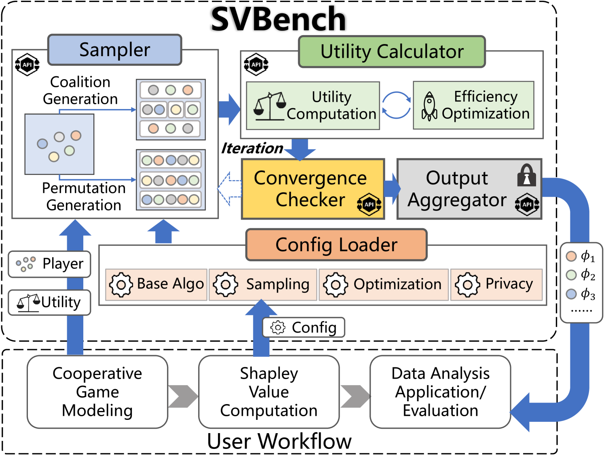

# ***SvBench*** 



***SvBench*** is a free, powerful benchmark providing a series of algorithms for exact computing and approximate computing of Shapley Value (SV) in data analysis (DA). SV is a solution concept from cooperative game theory. A cooperative game is composed of a player set and a utility function that defines the utility of each coalition (i.e., a subset of the player set). SV is designed for fairly allocating the overall utility generated by the collective efforts of all players within a game. This solution concept has already been widely applied in various DA tasks modeled as cooperative games for pricing, selection, weighting, and attrition of data and its derivatives (e.g., ML models well trained in DA tasks).

As shown in the figure, ***SvBench***  is composed of a config loader, a sampler, a utility calculator, a convergence checker, and an output aggregator for computing SV by iterative rounds. A round of SV calculation is conducted starting from the sampler and ending at the convergence checker.  Once the convergence criterion is not met, another round will be initiated as demonstrated in the figure (with dashed arrow). The following two tables summarize the functions of the five modules in  ***SvBench*** and the main parameters used by SV computing algorithms. Using the five modules, ***SvBench*** implements five base SV calculation algorithms (**MC**, **RE**, **MLE**, **GT**, and **CP**) and several hybrid algorithms, each combining one base algorithm with a specific efficiency optimization. For more detailed introduction of SV computing techniques, please refer to our [survey paper](https://arxiv.org/abs/2412.01460). 

|  Module | Description | Main Implemented Techniques |
| :------: | -------------------- | ------------ |
| **configuration loader** | Load the SV computing parameters specified by the users| / |
| **sampler** | Generate the coalitions or permutations of players based on the configured sampling strategy| Random Sampling, Stratified Sampling, Antithetic Sampling |
| **utility calculator** | Compute the utility of the sampled coalitions or permutations. When users specify an efficiency optimization strategy, the utility calculator will use that strategy to accelerate the computation. | Truncation, ML Speedup for Efficiency Optimization |
| **convergence checker** | Determine whether to terminate the SV computation based on the convergence criterion specified in the configuration | SV Ranking |
| **configuration loader** | Generate the final SV of each player. If users specify privacy protection measures, the aggregator will execute those measures before reporting the final results. | Measures (i.e., Differential Privacy, Quantization and Dimension Reduction) for Privacy Protection on SV. |

|  Config | Parameters  (Default setting is in bold.) |
| :------: | -------------------- |
| **Base Algo** | **`MC`**, `RE`, `MLE`, `GT`, `CP`, `user-specific` |
| **Sampling** | `None`,**`random`**, `antithetic`, `stratified`, `user-specific` |
| **Optimization** | **`None`**, `TC`, `GA`, `TC+GA`, `GA+TSS`, `TC+GA+TSS`, `user-specific` |
| **Privacy** | **`None`**, `DP`, `QT`, `DR`, `user-specific` |

Below, we show three typical DA tasks, namely **Result Interpretation(RI)**, **Data Valuation(DV)**, and **Federated Learning(FL)**, as example use cases and present how to use ***SvBench***  to implement different SV computing algorithms in these tasks.
The datasets, player set, and utility function used by each task are summarized in the following:

|  Dataset | # Training Data Tuples | # Test Data Tuples | # Features for Each Tuple | # Classes |
| :----: | --------- | --------- | --------- | --------- |
| **Iris** | 120  | 30 | 4 | 3|
| **Wine** | 142 | 36| 13 |3|
| **MNIST** | 60,000   | 10,000  | 1 x 28 x 28 |10|
| **Cifar-10** |  50,000  | 10,000   |  3 x 32 x 32 |10|

|  Task  | Dataset             | Player       | Utility       | Model               |
| :----: | -------------------- | ------------ | ------------- | ------------------- |
| **RI** | *Iris*    | data feature （n=4）  | Model Output  | *Multilayer Perceptron* |
| **RI** | *Wine*      | data feature （n=13） | Model Output  | *Multilayer Perceptron* |
| **DV** | *Iris*    | data tuple  （n=120） | Test Accuracy | *Multilayer Perceptron* |
| **DV** | *Wine*      | data tuple （n=142）  | Test Accuracy | *Multilayer Perceptron* |
| **FL** | *MNIST*  | ML model （n=10）| Test Accuracy | *Convolutional Neural Network*|
| **FL** | *Cifar-10* | ML model （n=10）  | Test Accuracy | *Convolutional Neural Network*|

- The RI task on Iris uses SV to explain how the four biological features influence the results of classifying three types of iris plants.
- The RI task on Wine explains how 13 chemical constituents influence the results of classifying three types of wine.
- The DV tasks on Iris and Wine use SV to evaluate the importance of 120 iris plants and 142 wine samples to improve the classification accuracy. 
- The FL tasks on MNIST and Cifar-10 distribute the two datasets to 10 devices, using SV to valuate the local models trained by those devices for the higher accuracy in handwritten digits classification and object recognition.

[](https://github.com/apecloud/foxlake/blob/main/LICENSE) [](https://github.com/DDDDDstar/SV4DA/actions/workflows/codeql.yml) [](https://github.com/DDDDDstar/SV4DA/graphs/contributors) [](https://www.python.org/)

## Get Started

To use ***SvBench***, you need first to download all the codes to your project directory, which is supposed to be looked like this:

```
.
├── Tasks
│   ├── Nets.py
│   ├── data_preparation.py
│   ├── data_valuation.py
│   ├── federated_learning.py
│   └── result_interpretation.py
├── calculator.py
├── config.py
├── output.py
├── privacy_utils.py
├── run.py
└── sampler.py
```

After this, to run the three benchmark tasks, you could just run the `run.py` directly with relevant parameters.

For example, run the DV task with *Iris* dataset, *regression* model, and **MC** algorithm to calculate SVs:

```sh
python -u run.py --task=DV --dataset=iris --algo=MC --ep=30 --bs=16 --lr=0.01
```

In addition to running benchmark tasks, SvBench also supports users to implement their own DA tasks by parameter settings and remaking the **Sampler** and **Calculator** modules.

The specific parameter settings are explained as follows.

## Parameters

### Parameters for benchmark tasks

To run the benchmark tasks of ***SvBench***, there are the following parameters:

|    Parameter    |         Scope          | Introduction                                                 | Default | Applicable Algorithms |
| :-------------: | :-------------------------------: | ------------------------------------------------------------ | :-----: | --------------- |
|   task   |                 {`DV` `FL` `RI`}                 | The name of the benchmark task. |    -    | - |
| dataset |                 {`iris` `wine`} for **DV** and **RI** tasks, {`mnist` `cifar`} for **FL** task                 | The dataset for tasks. |    -    | - |
|     algo     | {`MC` `RE` `MLE` `GT` `CP`} | The algorithm used to calculate SV. Five algorithms of Monte Carlo random sampling(`MC`), regression-based SV formulation(`RE`), multilinear-extension-based SV formulation(`MLE`), group-testing-based SV formulation(`GT`) and compressive-permutation-based SV formulation(`CP`) are provided. |  `MC`   | - |
|   convergence_threshold    |                             0~1                              | Convergence threshold to check the resultant SVs.            |   0.1    | - |
|             ep             |                              -                               | The number of epoch for ML in utility computation.           |    30    | - |
|             bs             |                              -                               | The batch size for ML in utility computation.                |    16    | - |
| lr | 9 | The learning rate for ML in utility computation. | 0.01 | - |
| sampling_strategy | `random` `antithetic` `stratified` | Three sampling strategies of random sampling, antithetic sampling and stratified sampling are provided to reduce the approximate error. | `random` | - |
| truncation | `True` `False` | Whether to truncate the unnecessary calculations of some marginal contributions in runtime of approximating SV. | `False` | - |
| truncation_threshold | - | Threshold setted in truncation to influence the extent of truncating unnecessary calculations using this technology. | 0.01 | - |
| privacy_protection_measure | `DP` `QT` `DR` | The measure to protect privacy. Three methods of differential privacy(`DP`), quantization(`QT`) and dimension reduction(`DR`) are provided. | `None` | - |
| privacy_protection_level | 0 ~ 1 | The intensity level of providing privacy protection measures, 1 for the highest intensity protection, 0 for non-protection. | 0.0 | - |
| num_parallel_threads | - | The number of threads used for parallel computing. | 1 | - |
| MLE_maxInterval | - | The maximum interval that can be reached in MLE to limit the running time of the algorithm. | 10000 | `MLE` |
| GT_epsilon | - | The epsilon used in GT method. | 0.00001 | `GT` |
| CP_epsilon | - | The epsilon used in CP method. | 0.00001 | `CP` |
| num_measurement | - | The number of measurement. | 10 | `CP` |
|  |  |  |  |  |
|  |  |  |  |  |

## Parameters for User-specific

|    Parameter     | Type | Examples              | Note                                                         |
| :--------------: | :--: | --------------------- | ------------------------------------------------------------ |
|       task       | str  | "feature_attribution" | There must be a `{task}.py` under the `Tasks/` directory.    |
| utility_function | str  | "{task}.utility_calc" | There must be a `{task}.utility_calc` function in `{task}.py`. |
|       algo       | str  | "newSV"               |                                                              |
|                  |      |                       |                                                              |
|                  |      |                       |                                                              |
|                  |      |                       |                                                              |
|                  |      |                       |                                                              |
|                  |      |                       |                                                              |
|                  |      |                       |                                                              |

